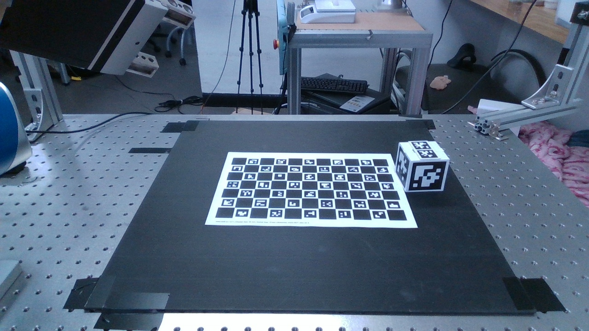
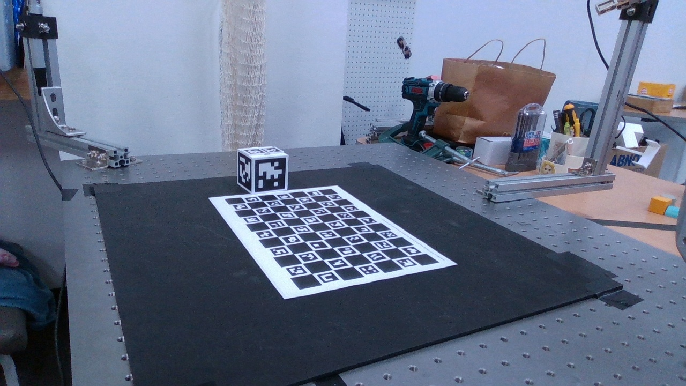
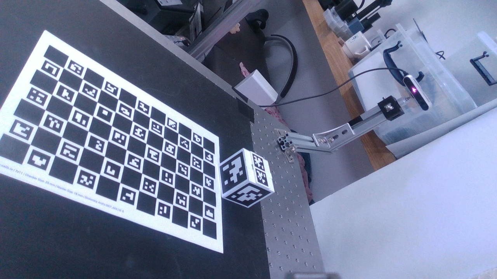
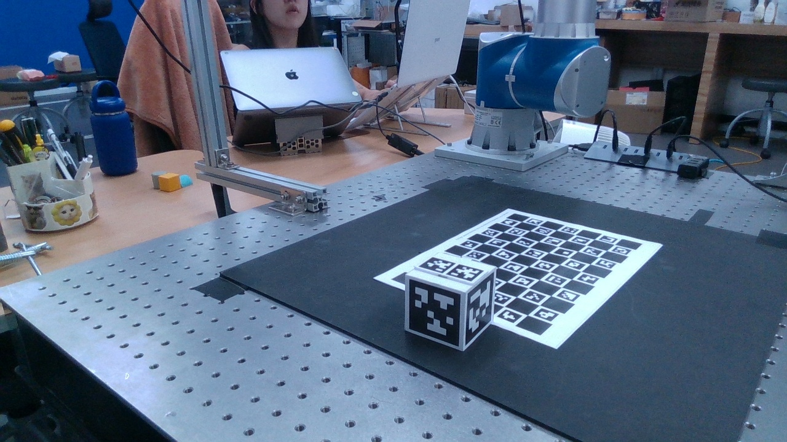
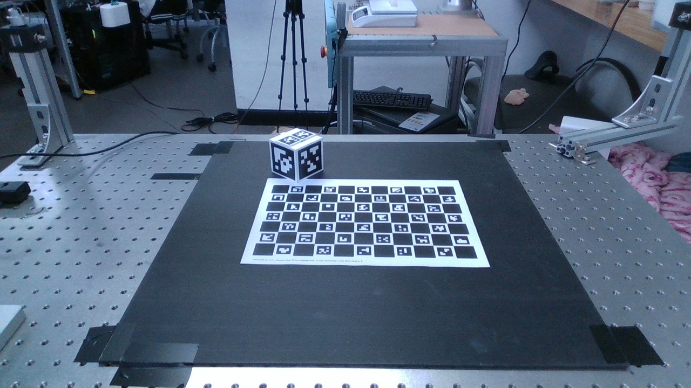
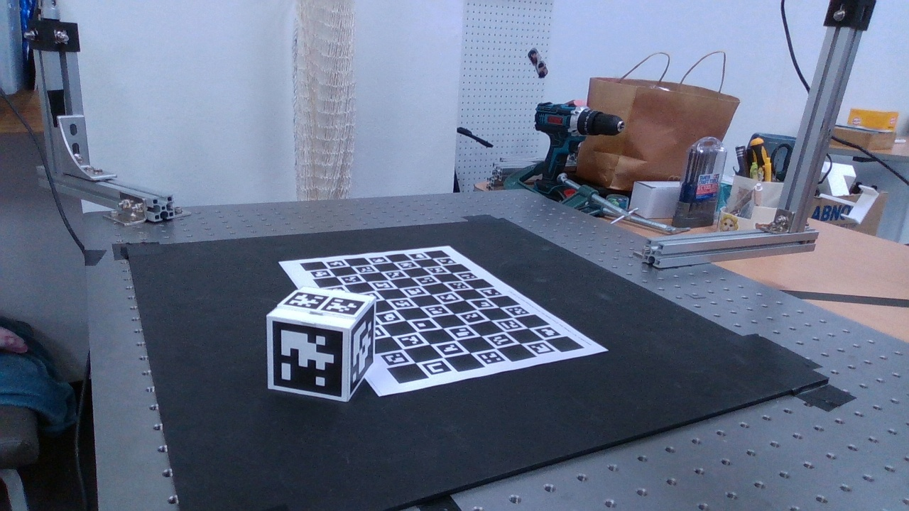
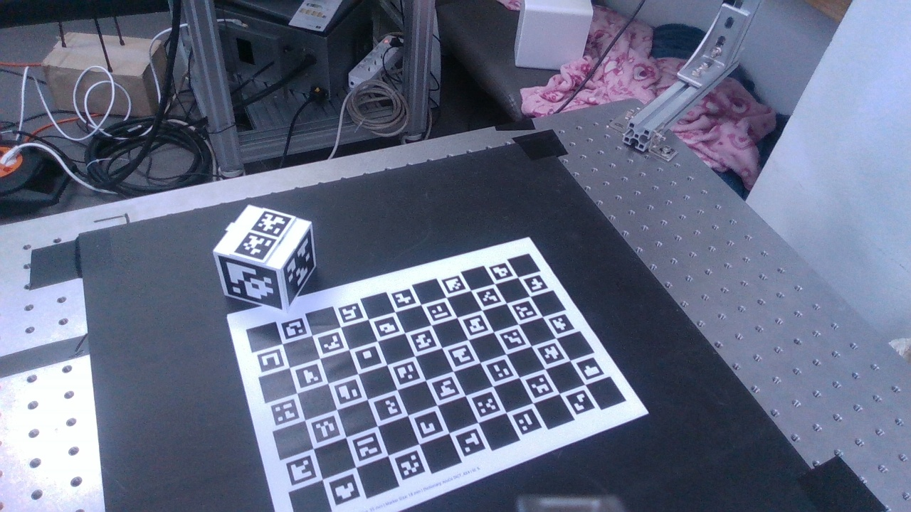
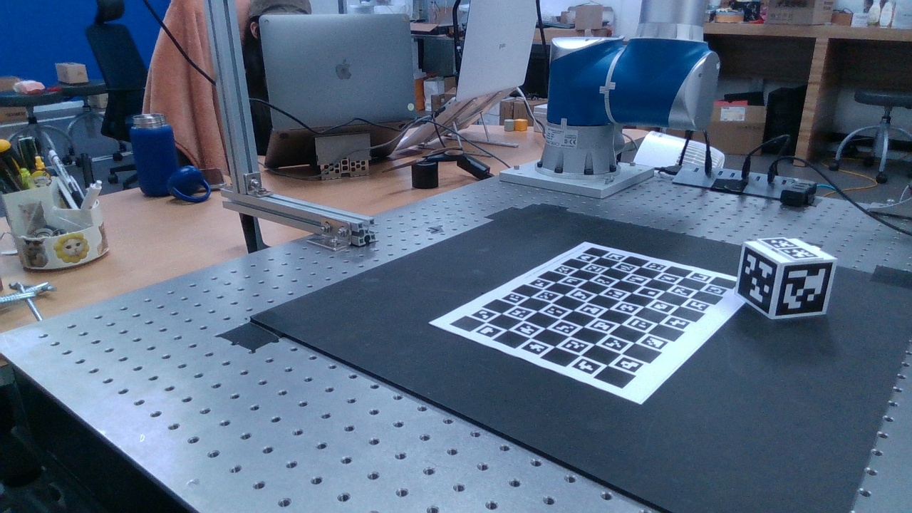
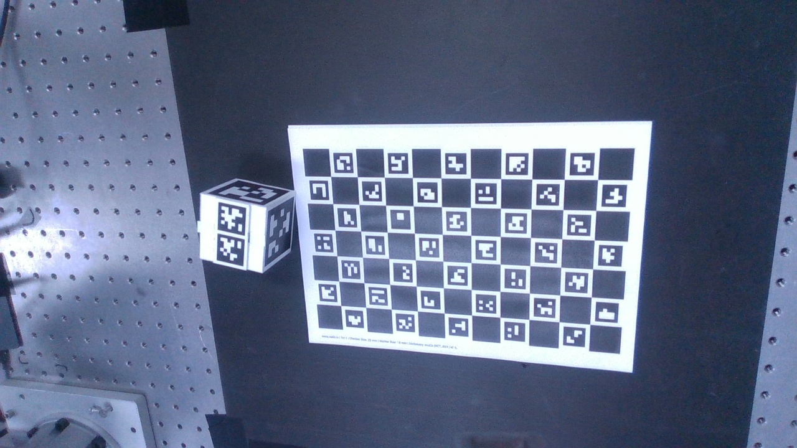

# 교수님 캘리브레이션 피드백에 대한 코드 근거 및 답변

이 문서는 녹음 전사본의 캘리브레이션 관련 질문을 요약하고, 현재 실행 코드가 각 쟁점을 어떻게 구현하는지 연결한 답변서다. 전사 문장은 구어체와 일부 인식 오류가 있어 질문의 취지를 기준으로 정리했다. 코드와 canonical 결과 파일을 최종 근거로 삼는다.

각 질문은 다음 순서로 답한다.

1. **짧은 답변**: 교수님께 바로 답할 결론
2. **코드 위치와 실제 구현**: 선언만이 아니라 실행 경로에서 무엇이 계산되는지
3. **수식**: 코드와 동일한 좌표계·단위·집계 방식
4. **실제 데이터와 결과**: 현재 `session02` canonical artifact의 수치와 사용 이미지
5. **해석 한계**: 현재 결과로 말할 수 있는 것과 말할 수 없는 것

## 이 문서가 근거로 삼는 실행 결과

수치는 아래 저장 파일을 직접 대조한 것이다.

| 근거 파일 | 역할 |
| --- | --- |
| [`table1_methods.json`](CP_result/session02/late_table1/table1_methods.json) | 조건별 3개 initialization run, solver 진단, held-out 지표, transform |
| [`table1_results.csv`](CP_result/session02/late_table1/table1_results.csv) | Table 1 평균 요약 |
| [`cross_target_evaluation.csv`](CP_result/session02/cross_target_evaluation/cross_target_evaluation.csv) | 모든 방법에 동일한 fixed-camera 관측을 적용한 공통 평가의 평균·표준편차 |
| [`marker_system_end_to_end.csv`](CP_result/session02/marker_system_end_to_end/marker_system_end_to_end.csv) | board-only, cube-only, board+cube를 각각 독립 초기화한 end-to-end 비교 |
| [`meta.json`](data/session02/calib_train/meta.json) | 캡처 event, 카메라별 저장 이미지, 검출 메타데이터 |
| [`pose_convention_manifest.json`](data/session02/calib_train/pose_convention_manifest.json) | 서로 달랐던 TCP/cube-center 좌표계의 정규화 규칙 |

재현성 식별자는 다음과 같다.

| 항목 | 현재 canonical 값 |
| --- | --- |
| `meta.json` SHA-256 | `b90b8c9e43a30d4ed479714fbb878f2e00b8ee215837548de001a1affe8380c8` |
| eligible 관측 SHA-256 | `182baa8ebb9294258dd911a93898104418f90b0652317bc00d79710d88fcc7cb` |
| train 관측 SHA-256 | `52af9873e183bd01591333a847ba6598758c9c05ad18e99e99679a82061b44f6` |
| held-out 관측 SHA-256 | `d7c6253a746d480f247610ece47dd7011a1353c27331bb637dfbbc7195479ef5` |
| 공통 path mask SHA-256 | `a7b9df814f3cc33a436e32ff12cc112d250cec1a02a82953dc4304772e3cd62e` |
| pose convention manifest SHA-256 | `f84ccd46eb08b907158a81638e32fc77e94005e6d4aac1ba2ca233ce6ded3a1b` |

> 결과표의 `mean ± std`는 **동일 데이터에 초기화 seed 0, 1, 2를 적용한 3회 최적화의 평균과 population standard deviation**이다. 서로 독립적으로 다시 수집한 데이터 3세트의 반복 측정 오차나 통계적 신뢰구간이 아니다. 세 run은 모두 수렴했다.

## 먼저 구분해야 하는 네 가지 평가 모집단

같은 `px`라도 평가 표본이 다르면 숫자를 직접 비교하면 안 된다.

| 이름 | 실제 표본 | 용도 | A3 값 |
| --- | --- | --- | ---: |
| Train overall | 123 observations / 3,877 corners | 최적화 적합도 진단 | `3.9662 px` |
| Own held-out overall | 30 observations / 901 corners, board+cube, fixed+gripper | 주 held-out 예측 오차 | `2.5315 px` |
| Common fixed-camera overall | 12 observations / 229 corners, event 29·53의 fixed cam 0·1·3 | 모든 방법의 동일 표본 비교 | `2.0105 ± 0.0001 px` |
| Cross-view path | fixed-camera pair 6개 / 방향 12개, event 29·53 | target pose를 공유하지 않는 카메라 간 전이·일관성 | `9.6520 px`, `11.5631 mm`, `0.8442 deg` |

특히 `2.5315 px`와 `2.0105 px`는 같은 지표의 서로 다른 표기가 아니다. 전자는 9개 held-out event의 고정카메라와 그리퍼 카메라를 모두 포함하고, 후자는 모든 방법이 공통으로 예측할 수 있는 event 29·53의 고정카메라 관측만 포함한다.

## 진행 범위

| 번호 | 쟁점 | 현재 상태 |
| --- | --- | --- |
| 1 | 독립된 물리 기준자/외부 GT로 절대 정확도 검증 | **추후 진행** |
| 2 | FK를 정답으로 취급하는 문제와 FK 불확실성 | 코드 수정 완료, 실측 covariance 전 결과는 `preflight` |
| 3 | 3대 카메라의 결합 방식, 목적함수, 단위와 수식 | 코드·수식 일치 확인 및 정리 완료 |
| 4 | 모든 방법에 동일한 데이터와 평가 기준 적용 | 코드 수정 및 동일 held-out 재평가 완료 |
| 5 | OpenCV/기존 연구 방법과의 외부 baseline 비교 | **추후 진행** |
| 6 | 아웃라이어 제거와 PnP/RANSAC 기준 | 코드 수정 및 공통 pre-fit mask 적용 완료 |

---

## 1. 독립된 외부 GT가 필요한가?

### 교수님의 피드백·질문

전사 위치: 약 `07:39~09:31`, `54:13~56:02`

- 로봇 FK나 영상으로 다시 만든 값을 정답으로 두지 말고, 자·지그·측정기처럼 캘리브레이션 계산과 독립된 물리 기준으로 최종 위치 정확도를 확인해야 한다.
- 특히 FK를 사용한 방법의 우수성을 FK가 포함된 평가식만으로 주장하면 순환 검증이 될 수 있다.

### 짧은 답변

맞다. 현재 데이터에는 독립된 물리 GT가 없으므로 절대 3D 위치·자세 정확도는 아직 검증하지 않았다. 현재 수치는 held-out 영상의 예측 오차와 경로 간 내부 일관성만 답하며, 외부 GT 실험은 요청대로 추후 진행한다.

### 현재 코드에 정확하게 표현된 방식

현재 코드는 외부 GT가 없다는 사실을 결과 protocol에 강제로 기록하며, 내부 지표를 절대 정확도로 부르지 못하게 한다.

```python
"e_task_pose": {
    "available_external_ground_truth": False,
    "may_be_described_as_absolute_accuracy": False,
    "protocol": "separate_position_holdout_not_event_holdout",
}
```

근거: [`calibration_pipeline/table1.py`](calibration_pipeline/table1.py#L1440-L1445), [`calibration_pipeline/cross_target.py`](calibration_pipeline/cross_target.py#L198-L203)

이 상태에서 독립 GT가 필요한 절대 pose 오차는 원리적으로 다음과 같이 정의해야 한다.

$$
e_{t,\mathrm{GT}}
=\left\|\widehat{\mathbf t}^{B}_{O}-\mathbf t^{B}_{O,\mathrm{GT}}\right\|_2
$$

$$
e_{R,\mathrm{GT}}
=\frac{180}{\pi}
\left\|\operatorname{Log}\!\left(
R^{B\mathsf T}_{O,\mathrm{GT}}\widehat R^{B}_{O}
\right)\right\|_2
$$

여기서 `GT` pose는 로봇 FK, 현재 calibration transform, 동일 영상 PnP 중 어느 것에서도 만들어지지 않은 독립 측정이어야 한다. 현재 저장 결과에는 이 조건을 만족하는 값이 없으므로 위 두 오차는 계산하지 않았다.

### 실제 데이터와 결과

| 확인 항목 | canonical 결과 |
| --- | --- |
| `available_external_ground_truth` | `false` |
| 절대 정확도라고 표현 가능 | `false` |
| 현재 허용된 task-pose 명칭 | `e_task_pose^{FK-proxy}` |
| 외부 GT용 position holdout | 미수집·미실행 |

따라서 뒤에서 제시하는 `e_cross`, `e_e2e`, pixel transfer, common reprojection은 모두 외부 GT의 대체물이 아니다. 이미지도 **입력 관측의 확인 자료**이지 측정기 기반 정답 영상이 아니다.

### 답변·설명

이 지적은 타당하다. 현재의 `e_cross`, `e_e2e`, 공통 target 재투영 오차는 모두 **내부 일관성 또는 내부 전이 성능**이지 독립적인 절대 3D 정확도가 아니다. 따라서 현재 결과로는 “물리적으로 가장 정확하다”는 결론을 내리지 않는다.

### 현재 상태

**추후 진행한다.** 독립 지그/측정 기준과 blind position holdout을 취득하기 전까지 외부 절대 정확도 열은 비활성 상태로 유지한다.

---

## 2. FK를 정답처럼 사용하면 FK 계열 방법에 유리하지 않은가?

### 교수님의 피드백·질문

전사 위치: 약 `11:46~12:26`, `34:18~35:00`, `54:13~56:02`

- FK를 truth로 두고 최적화한 방법이 FK 기반 오차에서 좋아지는 것은 당연하지 않은가?
- FK가 부정확한 저가 로봇에서도 같은 결론을 낼 수 있는가?
- FK를 고정하지 말고 불확실성을 반영했을 때 영상 재투영과 카메라 간 일관성은 어떻게 변하는가?

### 짧은 답변

맞는 지적이다. 그래서 현재 코드는 cube pose를 영상으로 추정하는 `A2`, FK에 고정하는 `A3`, 영상으로 움직일 수 있게 두되 FK 주변에 확률적 제약을 거는 `A4`를 분리한다. 다만 `A4`의 공분산은 실측값이 아니라 Simulation에서 가져온 `2.0 mm / 0.30 deg` prior이므로 `A4`를 확증 결과로 해석하지 않는다. 현재 데이터에서 A3는 픽셀·병진 일관성은 좋아졌지만 회전 지표가 모두 좋아진 것은 아니다.

### 현재 코드에 정확하게 표현된 방식

현재 실험은 FK 사용 강도에 따라 조건을 분리한다.

```python
A2: cube+board / unified / cube pose estimated
A3: cube+board / unified / cube pose FK-fixed
A4: cube+board / unified / cube pose corrected-FK-factor
```

근거: [`calibration_pipeline/schema.py`](calibration_pipeline/schema.py#L52-L66)

`A3`는 cube pose를 최적화 변수에서 제거한 hard-FK 조건이다.

```python
# cube transforms exist in state, but are absent from A3 free variables.
final_state, diag = solve_stage(
    relevant_train, UNIFIED_FREE_VARIABLES["A3"], initial_state, ...)
diag["fk_mode"] = "fixed"
```

근거: [`calibration_pipeline/table1.py`](calibration_pipeline/table1.py#L540-L550)

실제 `A3`, seed 0의 freeze manifest는 다음과 같다.

```text
free   = [cam:0, cam:1, cam:3, gtc:-1, board:-1]
frozen = [cube:5, cube:6, cube:7, cube:8,
          cube:9, cube:10, cube:11, cube:12]
```

즉 “FK를 loss에 넣었다” 정도가 아니라, A3에서는 여덟 개 cube pose 자체가 optimization vector에서 빠진다. 반대로 A4에서는 이 cube pose들이 다시 자유변수로 들어오고 아래의 whitened factor가 추가된다. 자유변수 선언의 단일 근거는 [`calibration_pipeline/schema.py`](calibration_pipeline/schema.py#L169-L175)다.

`A4/B1/B2`는 cube pose를 자유변수로 남기고, 보정된 FK pose에 대한 soft factor만 추가한다. 집합 `s`에 대해 구현된 잔차는

$$
\widetilde{T}^{B}_{O,s}
=T^{B}_{O,s,\mathrm{FK\,raw}}\,\Delta_{\mathrm{train}}
$$

$$
\xi_s=
\begin{bmatrix}
\operatorname{Log}\!\left(R_{O,s}^{\mathsf T}\widetilde R_{O,s}\right)\\
t\!\left((T^{B}_{O,s})^{-1}\widetilde T^{B}_{O,s}\right)
\end{bmatrix},
\qquad
w_s=L_s^{-1}\xi_s,\quad \Sigma_s=L_sL_s^{\mathsf T}
$$

이다. 회전은 rad, 병진은 m 단위다.

공분산은 현재 대각행렬이며 residual 순서가 회전 3축 뒤 병진 3축이므로,

$$
\Sigma_s
=\operatorname{diag}\!\left(
\sigma_R^2,\sigma_R^2,\sigma_R^2,
\sigma_t^2,\sigma_t^2,\sigma_t^2
\right),
\quad
\sigma_R=0.30\frac{\pi}{180}\ \mathrm{rad},
\quad
\sigma_t=0.002\ \mathrm{m}
$$

이다. `w_s`의 각 성분은 표준편차로 나눈 무차원 residual이다. 이 값에 Huber loss, scale `3.0`을 적용하므로 대략 3-sigma 안쪽은 제곱 손실이고 그 밖은 선형적으로 영향력이 증가한다. visual residual은 별도로 `soft_l1`, `2 px`로 robustification한 뒤 factor residual과 이어 붙이고, 최종 SciPy 호출은 `loss="linear"`로 푼다. 따라서 visual과 FK factor에 같은 robust scale을 잘못 중복 적용하지 않는다.

```python
residual = fk_pose_residual(estimated, target)
block = self.whiteners[set_index] @ residual
...
robustify_elementwise(block, "huber", 3.0)
```

근거: [`calibration_pipeline/fk_factor.py`](calibration_pipeline/fk_factor.py#L85-L100), [`calibration_pipeline/fk_factor.py`](calibration_pipeline/fk_factor.py#L230-L250), [`calibration_pipeline/table1.py`](calibration_pipeline/table1.py#L660-L685)

또한 `e_cross`는 FK 계열 방법에 유리한 FK 오차가 아니다. 고정카메라 `i`가 영상만으로 PnP한 cube pose를 base로 옮긴

$$
{}^{B}\!T_{O}^{(i)}
={}^{B}\!T_{C_i}\,{}^{C_i}\!T_{O,\mathrm{PnP}}
$$

를 카메라 쌍끼리 비교하며, 이 경로에는 robot FK, gripper camera, nominal cube pose, 외부 GT가 모두 없다.

```python
E_CROSS_CONTRACT = {
    "uses_robot_fk": False,
    "uses_gripper_camera": False,
    "uses_nominal_or_ground_truth_cube_pose": False,
    "absolute_accuracy_metric": False,
}
```

근거: [`calibration_pipeline/path_evaluation.py`](calibration_pipeline/path_evaluation.py#L28-L43)

정확한 한계는 구분해야 한다. `e_cross`를 **계산하는 식 자체**에는 평가 시 robot FK가 들어가지 않지만, A3의 `T_base_camera`는 FK-fixed cube를 사용한 train optimization의 결과다. 따라서 `e_cross`는 “FK를 정답으로 직접 빼는 자기참조 오차”는 아니지만, A3 학습과 통계적으로 완전히 독립된 외부 검증도 아니다. 그 역할은 1번의 물리 GT가 담당해야 한다.

실측 FK covariance를 넣을 때도 파일 형식, 단위, blind-GT 미사용, 사전등록 여부, 공분산의 양의 정부호성을 검사한다. 6차원 sample covariance가 full rank가 되려면 최소 `N-1 >= 6`, 즉 반복 측정 `N >= 7`이므로 그보다 적으면 실행을 거부한다.

근거: [`calibration_pipeline/table1.py`](calibration_pipeline/table1.py#L591-L638)

### 실제 데이터와 결과

아래는 같은 split과 같은 3개 initialization seed에서 얻은 평균이다. `A4`는 앞서 설명한 이유로 preflight다.

| 조건 | Cube pose 처리 | Own held-out overall (px) | Common fixed-camera (px) | Pixel transfer (px) | `e_cross` 병진 (mm) | `e_cross` 회전 (deg) | `e_e2e` 병진 (mm) | `e_e2e` 회전 (deg) |
| --- | --- | ---: | ---: | ---: | ---: | ---: | ---: | ---: |
| A2 | 영상으로 추정 | 2.9715 | 2.0628 | 12.0222 | 14.8495 | **0.8437** | 3.4324 | 0.8177 |
| A3 | corrected FK에 고정 | **2.5315** | **2.0105** | **9.6520** | **11.5631** | 0.8442 | **3.1686** | 0.9167 |
| A4 | soft FK factor, preflight | 2.9525 | 2.0592 | 11.9717 | 14.7545 | 0.8466 | 3.3922 | **0.8144** |

`A2 -> A3` 변화는 own held-out `-0.4400 px` 약 `-14.8%`, pixel transfer `-2.3702 px` 약 `-19.7%`, `e_cross` 병진 `-3.2864 mm` 약 `-22.1%`다. 그러나 `e_cross` 회전은 `+0.00045 deg`로 사실상 같고 약간 나빠졌으며, `e_e2e` 회전은 `+0.0990 deg` 약 `+12.1%` 나빠졌다. 따라서 현재 증거는 “hard-FK가 모든 지표를 개선했다”가 아니라 “이 세션에서 pixel/translation 계열은 개선됐지만 rotation 계열은 혼합됐다”다.

3개 seed에 대한 A3 공통 평가의 더 정확한 값은 다음과 같다.

| 지표 | mean ± initialization-seed std |
| --- | ---: |
| Common overall | `2.010543 ± 0.000097 px` |
| Common board | `2.207216 ± 0.000097 px` |
| Common cube | `1.494480 ± 0.000167 px` |
| Pixel transfer | `9.651992 ± 0.000638 px` |
| `e_cross` translation | `11.563064 ± 0.000733 mm` |
| `e_cross` rotation | `0.844184 ± 0.000459 deg` |
| `e_e2e` translation | `3.168602 ± 0.000564 mm` |
| `e_e2e` rotation | `0.916711 ± 0.000097 deg` |

### 답변·설명

교수님의 우려 때문에 FK가 포함된 `e_e2e` 하나로 A3를 평가하지 않는다. 같은 held-out 영상에서 raw pixel, 양방향 camera-to-camera pixel transfer, FK가 없는 `e_cross`를 함께 본다. 현재 A3는 held-out overall `2.5315 px`, pixel transfer `9.6520 px`, `e_cross` 병진 `11.5631 mm`로 full board+cube 조건 중 가장 작지만, 회전 지표는 다른 조건이 더 작다. 따라서 “A3가 모든 면에서 우수하다”가 아니라 “현재 내부 병진·픽셀 기준의 강한 후보”라고 답하는 것이 정확하다.

실측 covariance가 아직 없으므로 A4/B1/B2는 `2.0 mm`, `0.30 deg`의 Simulation prior를 사용한 `preflight_simulation_prior`로 표시된다. 저가 로봇에 대한 일반화나 hard-FK의 최종 채택 여부는 아직 입증되지 않았다.

### 현재 상태

코드 구조는 수정 완료했다. **실측 반복 데이터가 없는 soft-FK 결과는 확증 결과가 아니며**, 최종 판단은 1번의 외부 GT 및 실측 FK covariance 이후에 한다.

---

## 3. “3대 카메라를 같이 최적화한다”는 정확히 무슨 뜻인가?

### 교수님의 피드백·질문

전사 위치: 약 `12:47~24:25`, `31:40~36:18`

- PnP 식과 실제 calibration 목적함수는 무엇인가?
- 카메라 3대가 어떤 변수와 관측을 통해 연결되는가?
- 내부 파라미터 `K`는 고정인가, 같이 최적화하는가?
- projection error를 왜 mm로 표시했는가?
- 순차 최적화와 통합 최적화의 차이는 무엇인가?

### 짧은 답변

현재 데이터에는 **고정카메라 3대(cam0, cam1, cam3)와 그리퍼 카메라 1대(cam2)**가 있다. “3대 카메라를 같이 최적화한다”는 표현은 고정카메라 3대의 extrinsic만을 가리킨 축약 표현이고, 실제 unified 문제에는 cam2의 eye-in-hand 관측과 `T_gripper_cam`도 함께 들어간다. Calibration loss는 PnP pose 차이가 아니라 검출된 모든 2D corner의 distorted-image pixel residual이다. PnP는 초기화·품질검사·별도 path 평가에만 사용한다.

### 현재 코드에 정확하게 표현된 방식

카메라 `i`, 이벤트 `e`, target `O`, 코너 `X_n^O`에 대한 예측 픽셀은

$$
\widehat{\mathbf u}_{i,e,n}
=\pi\!\left(K_i,D_i,
\left({}^{B}\!T_{C_i}(e)\right)^{-1}
{}^{B}\!T_O\,X_n^O\right)
$$

이고 residual은

$$
\mathbf r_{i,e,n}=\widehat{\mathbf u}_{i,e,n}-\mathbf u_{i,e,n}
\quad[\mathrm{px}]
$$

이다. 고정카메라는 `T_base_cam = state.cams[i]`, 손목카메라는

$$
{}^{B}\!T_{C_g}(e)
={}^{B}\!T_G(e)\,{}^{G}\!T_{C_g}
$$

를 사용한다.

두 경로를 풀어 쓰면 다음과 같다.

고정카메라 `i in {0,1,3}`:

$$
{}^{C_i}\!\mathbf X_{O,n}
=\left({}^{B}\!T_{C_i}\right)^{-1}
{}^{B}\!T_O\,{}^{O}\!\mathbf X_n
$$

그리퍼 카메라 `g=2`:

$$
{}^{C_g}\!\mathbf X_{O,n}
=\left({}^{B}\!T_G(e){}^{G}\!T_{C_g}\right)^{-1}
{}^{B}\!T_O\,{}^{O}\!\mathbf X_n
$$

`pi(K,D,·)`는 OpenCV distortion model을 포함한 `cv2.projectPoints`다. 따라서 residual은 undistorted normalized coordinate가 아니라 원래 해상도의 distorted pixel 좌표에서 계산된다.

```python
if obs.cam == self.gripper:
    T_base_cam = self.robot_T[obs.event] @ state.gtc
else:
    T_base_cam = state.cams[obs.cam]

prediction = project_points(
    inv_T(T_base_cam) @ target,
    obs.object_points,
    self.K[obs.cam], self.D[obs.cam],
)
chunks.append((prediction - obs.image_points).reshape(-1))
```

근거: [`calibration_pipeline/reprojection.py`](calibration_pipeline/reprojection.py#L308-L350)

`K_i,D_i`는 `project_points()`에 상수로 전달되며 최적화 변수 목록에 들어가지 않는다. 즉 현재 실험은 intrinsic calibration을 다시 하는 것이 아니라 extrinsic/hand-eye/target pose를 구하는 문제다.

```python
projected, _ = cv2.projectPoints(object_points, rvec, tvec, K, D)
```

근거: [`calibration_pipeline/reprojection.py`](calibration_pipeline/reprojection.py#L143-L152)

실제 변수 구성은 다음과 같다. transform 하나는 left-local SE(3) 6자유도다.

| 조건 | 자유 transform | 고정 transform | 총 자유도 |
| --- | --- | --- | ---: |
| A0 seq stage 1 | `T_gripper_cam`, `T_base_board` | `K,D`, robot FK | 12 |
| A0 seq stage 2 | `T_base_C0`, `T_base_C1`, `T_base_C3`를 카메라별로 각각 계산 | stage 1 결과 | 카메라별 6 |
| A2 unified | 고정 cam 3개 + `T_gripper_cam` + board 1개 + cube set 8개 | `K,D`, robot FK | 78 |
| A3 unified | 고정 cam 3개 + `T_gripper_cam` + board 1개 | cube set 8개는 FK-fixed | 30 |
| A4 unified | A2와 동일한 13 transforms | cube에 soft FK factor | 78 |

근거: [`calibration_pipeline/schema.py`](calibration_pipeline/schema.py#L84-L177), [`calibration_pipeline/table1.py`](calibration_pipeline/table1.py#L518-L556)

통합(`U`) 조건에서는 모든 카메라·이벤트·마커의 residual을 하나의 벡터로 이어 붙여 한 번의 least-squares 문제로 푼다. 서로 다른 카메라 관측은 공유 `T_base_target`, 손목카메라의 `T_gripper_cam`, 각 고정카메라의 `T_base_cam`을 통해 결합된다. visual 목적함수는 component-wise pixel residual에 `soft_l1`, `f_scale=2 px`를 적용한다.

SciPy의 실제 visual objective를 그대로 쓰면

$$
\min_{\boldsymbol\theta}
F_{\mathrm{vis}}(\boldsymbol\theta)
=\frac{C^2}{2}\sum_k
\rho\!\left(\frac{r_k(\boldsymbol\theta)^2}{C^2}\right),
\qquad C=2\ \mathrm{px}
$$

$$
\rho(z)=2\left(\sqrt{1+z}-1\right)
$$

이다. 여기서 `k`는 각 corner의 `u`와 `v` 성분을 각각 센 index다. 즉 한 corner는 residual vector에 2개 성분을 만든다.

```python
SolverOptions(method="trf", loss="soft_l1", f_scale_px=2.0, ...)
```

근거: [`calibration_pipeline/reprojection.py`](calibration_pipeline/reprojection.py#L104-L114), [`calibration_pipeline/table1.py`](calibration_pipeline/table1.py#L480-L496)

순차(`seq`) 조건은 eye-in-hand stage를 먼저 푼 뒤 그 결과를 동결하고 eye-to-hand stage를 푼다. 통합 조건은 선언된 모든 자유변수를 같은 residual vector에서 동시에 푼다.

근거: [`calibration_pipeline/table1.py`](calibration_pipeline/table1.py#L518-L556)

평가 RMSE는

$$
e_{\mathrm{reproj}}^{\mathrm{px}}
=\sqrt{\operatorname{mean}\left(
(\widehat u-u)^2,(\widehat v-v)^2\right)}
$$

로, native distorted image의 **px만** 보고한다.

위 식의 분모를 명시하면 corner 수 `N`일 때

$$
e_{\mathrm{reproj}}^{\mathrm{px}}
=\sqrt{\frac{1}{2N}\sum_{n=1}^{N}
\left[
(\widehat u_n-u_n)^2+(\widehat v_n-v_n)^2
\right]}
$$

이다. 반면 2차원 Euclidean distance의 RMS는 분모가 `N`이므로 이 값의 `sqrt(2)`배다. 현재 결과 파일은 일관되게 전자의 **component-wise RMSE**를 사용한다.

근거: [`calibration_pipeline/evaluation.py`](calibration_pipeline/evaluation.py#L122-L209)

### 실제 A3 solver 및 데이터 결과

seed 0의 실행 기록은 다음과 같다.

| 항목 | 실제 값 |
| --- | ---: |
| Train observations / corners | `123 / 3,877` |
| Residual vector 길이 | `7,754 = 2 × 3,877` |
| 자유 parameter | `30 = 5 transforms × 6` |
| 초기 train RMSE | `4.158421 px` |
| 최종 train RMSE | `3.966220 px` |
| 함수 평가 횟수 | `12` |
| 종료 사유 | `ftol` satisfied |
| Jacobian rank / nullity | `30 / 0` |
| Jacobian condition number | `119.565` |

Rank가 30으로 자유도 30과 같으므로 이 선형화 지점에서 명백한 gauge null space는 검출되지 않았다. 다만 condition number는 관측 가능성의 절대 보증이 아니라 국소 선형화의 수치 진단이다.

같은 A3 seed 0의 전체 held-out 30 observations / 901 corners를 카메라별로 나누면 다음과 같다.

| 카메라 | 역할 | observations / corners | held-out RMSE |
| --- | --- | ---: | ---: |
| cam0 | fixed eye-to-hand | `4 / 103` | `0.5720 px` |
| cam1 | fixed eye-to-hand | `4 / 62` | `1.6203 px` |
| cam2 | gripper eye-in-hand | `18 / 672` | `2.8212 px` |
| cam3 | fixed eye-to-hand | `4 / 64` | `1.8907 px` |
| 전체 | fixed + gripper | `30 / 901` | `2.5314 px` |

이 분해는 전체 오차가 cam2의 672 corners에 크게 가중된다는 점을 보여준다. 그래서 방법 간 공정 비교에는 별도의 common fixed-camera 229-corner 지표도 함께 보고한다.

### 답변·설명

이 코드에서 “3대 카메라를 같이 최적화한다”는 말은 각 카메라의 PnP 결과를 평균낸다는 뜻이 아니다. 각 카메라의 원시 2D 코너 residual이 하나의 최적화 문제에 직접 들어가고, 공유 target/hand-eye 변수를 통해 서로 제약한다는 뜻이다. `K,D`는 사전 intrinsic calibration 결과로 고정된다.

기존의 projection error `mm` 표기는 원리적으로 부적절해 제거했다. 픽셀 오차에 예측 깊이를 곱한 값은 독립적인 3D 측정 오차가 아니고, 깊이 방향 오차도 포함하지 않기 때문이다. 물리 단위 오차는 1번의 독립 3D GT에서만 보고해야 한다.

### 현재 상태

목적함수·변수·단위가 코드와 보고서에서 일치하도록 수정 완료했다.

---

## 4. 모든 방법을 같은 데이터와 같은 기준으로 비교했는가?

### 교수님의 피드백·질문

전사 위치: 약 `42:38~49:47`

- 어떤 방법은 전체 데이터에 적합한 값을 보고하고 다른 방법은 split test 결과를 보고하면 비교가 성립하지 않는다.
- board-only 방법도 같은 raw image가 있다면 동일한 cube/카메라 경로 평가를 받아야 한다.
- 방법마다 유리한 관측만 남기거나 결과를 보고 outlier를 제거해서는 안 된다.

### 짧은 답변

현재 코드는 event 단위 set-stratified split 하나를 고정하고, 모든 행의 fitted parameter를 동결한 뒤 동일한 common fixed-camera 관측과 동일한 path mask로 다시 평가한다. 다만 각 행이 실제로 최적화한 marker만 보는 `own held-out`과 모든 행에 board+cube를 강제로 적용한 `common`을 구분해야 한다.

### 현재 코드에 정확하게 표현된 방식

split은 코너 단위가 아니라 event 단위이며 set별로 층화한다. 같은 이벤트의 여러 카메라 영상이 train/test에 나뉘는 누수를 막는다.

```python
events_by_set[set_idx].add(event)
...
rng = np.random.default_rng(seed)
...
test_events.update(chosen)
train_events.update(set(events) - set(chosen))
```

근거: [`calibration_pipeline/table1.py`](calibration_pipeline/table1.py#L321-L382)

현재 공통 seed는 `20260731`, held-out event는

```text
[29, 38, 46, 50, 53, 61, 69, 75, 92]
```

이다. 모든 조건은 동일 raw detections, `K,D`, 초기 seed, split과 **solver 호출당** tolerance·`max_nfev=300`을 사용한다. 순차 조건은 stage 1 뒤 고정카메라별 stage 2를 호출하므로 총 함수 평가 예산·계산량까지 unified와 같다는 뜻은 아니다.

실제 set별 split은 다음과 같다. set 11만 캡처가 12개이므로 held-out이 2개이고, 나머지는 6개 중 1개다.

| Set | Train events | Held-out events |
| ---: | --- | --- |
| 5 | 30, 31, 32, 33, 34 | **29** |
| 6 | 35, 36, 37, 39, 40 | **38** |
| 7 | 41, 42, 43, 44, 45 | **46** |
| 8 | 47, 48, 49, 51, 52 | **50** |
| 9 | 54, 55, 56, 57, 58 | **53** |
| 10 | 59, 60, 62, 63, 64 | **61** |
| 11 | 65, 66, 67, 68, 70, 90, 91, 93, 94, 95 | **69, 92** |
| 12 | 71, 72, 73, 74, 76 | **75** |

관측 모집단의 실제 크기는 다음과 같다.

| 모집단 | Events | Observations | Corners | Board | Cube | Eye-in-hand | Eye-to-hand |
| --- | ---: | ---: | ---: | ---: | ---: | ---: | ---: |
| Eligible 전체 | 54 | 153 | 4,778 | — | — | — | — |
| Train | 45 | 123 | 3,877 | `61 / 3,033` | `62 / 844` | `88 / 3,237` | `35 / 640` |
| Held-out 전체 | 9 | 30 | 901 | `15 / 693` | `15 / 208` | `18 / 672` | `12 / 229` |
| Common fixed-camera | 2 | 12 | 229 | `6 / 157` | `6 / 72` | `0 / 0` | `12 / 229` |

Board·Cube·role 열의 표기는 `observations / corners`다. Eligible 행의 세부 분해보다 해당 모집단의 digest와 총수를 재현성 계약으로 저장한다.

평가에서는 fitted parameter를 동결하고, 전달된 held-out observation을 하나라도 임의로 버리지 않는다.

```python
"test_time_refit": False,
"model_dependent_test_gating": False,
...
if target is None:
    raise RuntimeError(...)  # silently drop하지 않음
```

근거: [`calibration_pipeline/table1.py`](calibration_pipeline/table1.py#L1400-L1445), [`calibration_pipeline/evaluation.py`](calibration_pipeline/evaluation.py#L122-L209)

공통 path mask 역시 calibration fit 전에 만들며 방법 출력으로 선택할 수 없다.

```python
if mask["model_output_used_for_selection"] is not False:
    raise ValueError(...)
if mask["output_dependent_pose_gate"] is not None:
    raise ValueError(...)
```

근거: [`calibration_pipeline/path_evaluation.py`](calibration_pipeline/path_evaluation.py#L239-L254)

공통 mask가 실제로 포함한 cube 관측은 15개이며 PnP-invalid는 0개다. 그러나 세 고정카메라가 모두 저장되고 cam2까지 함께 존재하여 cross와 end-to-end 경로를 동시에 만들 수 있는 held-out event는 **29(set 5)**와 **53(set 9)**뿐이다.

```text
fixed cameras = [0, 1, 3]
gripper camera = 2
cross pairs    = 3 camera pairs/event × 2 events = 6
pixel transfer = 2 directions/pair × 6 pairs = 12
e_e2e units    = event 29, event 53 = 2
PnP invalid    = 0
output-based rejection = 0
```

board-only를 포함한 모든 방법은 저장된 transform을 재적합하지 않고 동일한 held-out fixed-camera board+cube 관측으로 별도 cross-target 평가를 받는다.

```python
for method in METHOD_ORDER:
    evaluate_common_target_run(
        run["transforms"], common_cameras, observations,
        prepared.board_initial, prepared.fixed_cubes, ...)
```

근거: [`calibration_pipeline/cross_target.py`](calibration_pipeline/cross_target.py#L145-L178)

공통 target reprojection에서는 모든 방법의 calibrated camera transform만 가져오고, target pose는 동일한 train-only reference로 고정한다. 따라서 방법 `m`의 공통 픽셀 오차는

$$
e_{\mathrm{common}}^{(m)}
=\sqrt{\frac{1}{2N_{\mathrm{common}}}
\sum_{k=1}^{N_{\mathrm{common}}}
\left\|
\pi\!\left(
K_i,D_i,
({}^{B}\!T_{C_i}^{(m)})^{-1}
{}^{B}\!T_{O,\mathrm{train-ref}}
{}^{O}\!\mathbf X_k
\right)-\mathbf u_k
\right\|_2^2}
$$

이다. 이 식은 공통 비교에는 유용하지만 `T_{O,train-ref}`가 독립 GT가 아니므로 절대 정확도는 아니다.

Cross-view pixel transfer는 source 카메라의 측정 corner로 PnP한 pose를 destination 카메라에 옮긴다.

$$
{}^{C_j}\!T_{O}^{(i\rightarrow j)}
=({}^{B}\!T_{C_j})^{-1}
{}^{B}\!T_{C_i}
{}^{C_i}\!T_{O,\mathrm{PnP}}
$$

$$
e_{\mathrm{transfer}}
=\sqrt{\frac{1}{2N_{\mathrm{transfer}}}
\sum_{(i\rightarrow j),n}
\left\|
\pi\!\left(K_j,D_j,
{}^{C_j}\!T_{O}^{(i\rightarrow j)}{}^{O}\!\mathbf X_n
\right)-\mathbf u_{j,n}
\right\|_2^2}
$$

여기서 `N_transfer`는 12라는 방향 개수가 아니라 12개 방향에 들어간 destination corner 수의 합이다. 코드에서는 모든 `(u,v)` 성분의 제곱을 한 벡터에 누적한다.

`e_cross`는 각 고정카메라가 측정한 cube pose를 base로 옮긴 뒤 pairwise 차이를 계산한다.

$$
{}^{B}\!T_{O}^{(i)}
={}^{B}\!T_{C_i}{}^{C_i}\!T_{O,\mathrm{PnP}}
$$

$$
e_{\mathrm{cross},t}
=\sqrt{\frac{1}{|\mathcal P|}
\sum_{(i,j)\in\mathcal P}
\left\|\mathbf t_O^{(i)}-\mathbf t_O^{(j)}\right\|_2^2}
$$

$$
e_{\mathrm{cross},R}
=\sqrt{\frac{1}{|\mathcal P|}
\sum_{(i,j)\in\mathcal P}
\left(
\frac{180}{\pi}
\left\|\operatorname{Log}\!\left(R_O^{(i)\mathsf T}R_O^{(j)}\right)\right\|_2
\right)^2}
$$

마지막으로 `e_e2e`는 같은 event의 고정카메라 3대가 예측한 cube pose의 robust SE(3) 평균과 cam2 경로를 비교한다.

$$
{}^{B}\!T_{O,\mathrm{fixed}}
=\operatorname{Avg}_{SE(3)}\!\left(
{}^{B}\!T_O^{(0)},{}^{B}\!T_O^{(1)},{}^{B}\!T_O^{(3)}
\right)
$$

$$
{}^{B}\!T_{O,\mathrm{eih}}
={}^{B}\!T_G(e){}^{G}\!T_{C_2}{}^{C_2}\!T_{O,\mathrm{PnP}}
$$

두 pose의 translation norm과 SO(3) geodesic angle을 event 29·53에 대해 RMS 집계한다. 이 경로는 robot FK를 포함하므로 FK와 독립적인 지표가 아니다. 반대로 `e_cross`와 pixel transfer에는 robot FK와 cam2가 들어가지 않는다.

단, 두 평가를 구분해야 한다.

- `own Test px`: 각 방법이 실제 목적함수에 사용한 marker population에 대한 held-out 성능. marker 구성이 다르면 직접 순위를 매기지 않는다.
- `Common px / pixel transfer / e_cross`: 모든 방법에 같은 관측 population을 적용하는 공통 내부 비교.

exact corner population, `meta.json`, intrinsics, pose manifest, 핵심 구현 파일의 SHA-256도 결과에 기록하여 데이터나 코드가 바뀐 오래된 결과를 재사용하지 못하게 했다.

근거: [`calibration_pipeline/evaluation.py`](calibration_pipeline/evaluation.py#L94-L119), [`calibration_pipeline/table1.py`](calibration_pipeline/table1.py#L1116-L1140)

### 답변·설명

현재 표는 전체 데이터 적합값과 held-out값을 섞지 않는다. 모든 비교의 주 평가는 동일한 event holdout에서 수행한다. 또한 board-only 결과도 cube가 포함된 공통 fixed-camera 관측에서 평가되지만, 그때 사용하는 target pose는 train-only 내부 기준이므로 외부 GT라고 부르지 않는다.

현재 공통 관측은 `12 observations / 229 corners`, camera pair는 `6`, 양방향 pixel transfer는 `12 directions`다. 같은 기준에서 A3의 common overall은 `2.0105 px`, A2는 `2.0628 px`, A4는 `2.0592 px`다. 이 수치는 내부 transfer 성능 비교에는 쓸 수 있지만 절대 3D 정확도 주장은 할 수 없다.

모든 executable ablation 행의 실제 평균을 한 표에 모으면 다음과 같다.

| 행 | 상태 | Own test overall (px) | Common overall (px) | Common board (px) | Common cube (px) | Transfer (px) | Cross t (mm) | Cross R (deg) | E2E t (mm) | E2E R (deg) |
| --- | --- | ---: | ---: | ---: | ---: | ---: | ---: | ---: | ---: | ---: |
| A0 | complete | 2.4675 | 2.0193 | **2.1445** | 1.7148 | 11.7971 | 14.2795 | 0.8603 | 2.9446 | 0.9976 |
| A1 | complete | 2.9942 | 2.0975 | 2.2221 | 1.7962 | 12.7282 | 15.8616 | **0.8086** | 3.7887 | 0.7973 |
| A2 | complete | 2.9715 | 2.0628 | 2.2345 | 1.6268 | 12.0222 | 14.8495 | 0.8437 | 3.4324 | 0.8177 |
| A3 | complete | 2.5315 | **2.0105** | 2.2072 | **1.4945** | **9.6520** | **11.5631** | 0.8442 | 3.1686 | 0.9167 |
| A4 | preflight | 2.9525 | 2.0592 | 2.2310 | 1.6228 | 11.9717 | 14.7545 | 0.8466 | 3.3922 | 0.8144 |
| B1 | preflight | 2.9729 | 2.0903 | 2.2169 | 1.7833 | 12.6368 | 15.7124 | 0.8119 | 3.7334 | **0.7944** |
| B2 | preflight | 4.2202 | 2.9214 | 3.0008 | 2.7403 | 11.1316 | 14.0157 | 1.0872 | 4.1085 | 0.8250 |
| B3 | complete | 2.4675 | 2.0195 | 2.1446 | 1.7152 | 11.7964 | 14.2776 | 0.8608 | **2.9440** | 0.9978 |

이 표의 굵은 값은 열별 최소값일 뿐이며, 서로 다른 목적의 행을 하나의 종합 순위로 합친 것은 아니다. 특히 `Own test overall`은 A0/B3에서는 board만, B2에서는 cube만, 나머지에서는 board+cube이므로 행 간 공정한 종합 순위에는 `Common` 열을 사용해야 한다. A4/B1/B2는 실측 covariance가 없는 preflight라서 complete 행과 같은 증거 수준도 아니다.

또한 Table 1 ablation의 B2/B3는 **공통 all-marker 초기화에서 residual/variable을 제거한 비교**다. 진짜로 처음부터 marker 하나만 써서 초기화한 end-to-end 비교는 별도 실행이며 결과가 다르다.

| End-to-end 시스템 | Own held-out (px) | Common overall (px) | Common board (px) | Common cube (px) | Transfer (px) | Cross t/R | E2E t/R |
| --- | ---: | ---: | ---: | ---: | ---: | --- | --- |
| Board-only | **2.4676** | **2.0195** | **2.1445** | 1.7157 | 11.7990 | `14.2816 mm / 0.8605 deg` | `2.9450 mm / 0.9977 deg` |
| Cube-only | 4.2799 | 2.9834 | 3.0575 | 2.8150 | **11.3110** | `14.2441 mm / 1.0662 deg` | `4.2222 mm / 0.8321 deg` |
| Board+Cube | 2.9715 | 2.0628 | 2.2345 | **1.6268** | 12.0222 | `14.8495 mm / 0.8437 deg` | `3.4324 mm / 0.8177 deg` |

여기서도 own held-out은 marker 모집단이 달라 직접 순위를 매기기 어렵다. 공통 표본에서는 board-only의 overall이 가장 작고 board+cube의 cube 오차가 가장 작으며, cube-only가 전체적으로 가장 좋다는 증거는 없다. 근거 파일은 [`marker_system_end_to_end.csv`](CP_result/session02/marker_system_end_to_end/marker_system_end_to_end.csv)다.

### A3의 실제 pair별 결과: seed 0

평균 하나가 어떤 pair에서 나왔는지 숨기지 않기 위해 seed 0의 6개 pair를 그대로 적었다. `i→j / j→i` 값 뒤 괄호는 destination cube corner 수다.

| Event·set | Pair | Pose 차이 t/R | Pixel transfer `i→j` | Pixel transfer `j→i` |
| --- | --- | --- | ---: | ---: |
| 29·5 | cam0–cam1 | `13.7356 mm / 0.1118 deg` | `3.1893 px (8)` | `14.0698 px (16)` |
| 29·5 | cam0–cam3 | `6.8272 mm / 0.3367 deg` | `6.4384 px (16)` | `3.5183 px (16)` |
| 29·5 | cam1–cam3 | `17.2121 mm / 0.2646 deg` | `17.7560 px (16)` | `4.3129 px (8)` |
| 53·9 | cam0–cam1 | `11.1109 mm / 0.2808 deg` | `13.3148 px (12)` | `4.3159 px (8)` |
| 53·9 | cam0–cam3 | `8.7901 mm / 1.4526 deg` | `9.6388 px (12)` | `3.8082 px (8)` |
| 53·9 | cam1–cam3 | `8.3723 mm / 1.3764 deg` | `4.9486 px (12)` | `5.0967 px (12)` |

이 표는 방향별 난이도가 대칭이 아님을 보여준다. 예를 들어 event 29의 cam1→cam3은 `17.7560 px`지만 반대 방향은 `4.3129 px`다. 목적지에서 실제로 보이는 face와 corner 수가 다르기 때문에 전이 오차는 방향에 따라 달라질 수 있으며, 최종 `9.6523 px`는 모든 방향의 모든 pixel 성분을 통합한 값이다.

A3 seed 0의 `e_e2e`도 event 29에서 `3.1066 mm / 0.4235 deg`, event 53에서 `3.2301 mm / 1.2251 deg`다. 최종 RMS는 `3.1689 mm / 0.9166 deg`다.

### 공통 평가에 실제 사용된 held-out 이미지

아래는 공통 path 6 pairs와 2 e2e units를 만드는 실제 원본 프레임이다. 보드와 큐브가 동시에 보이는 두 event만 공통 path를 구성한다. cam0·1·3은 fixed-camera cross/common 평가, cam2는 gripper-camera e2e 경로에 사용된다.

**Event 29 · set 5**

| cam0 · fixed · cube 16 corners | cam1 · fixed · cube 8 corners |
| --- | --- |
|  |  |
| cam2 · gripper · cube 16 corners | cam3 · fixed · cube 16 corners |
|  |  |

**Event 53 · set 9**

| cam0 · fixed · cube 8 corners | cam1 · fixed · cube 12 corners |
| --- | --- |
|  |  |
| cam2 · gripper · cube 16 corners | cam3 · fixed · cube 12 corners |
|  |  |

Corner 수는 캡처 당시 화면 표시값이 아니라 canonical path artifact에서 해당 방향의 destination observation에 저장된 실제 cube object/image point 수다. 원본 파일은 수치 결과와 연결되는 입력 증거다. 현재 canonical result 폴더에는 prediction overlay 이미지가 저장되어 있지 않으므로, 과거 `calib_out/verify` 그림을 현재 Table 1의 결과인 것처럼 섞어 넣지 않았다.

Held-out event 92는 cam2 이미지만 저장되어 있다.



따라서 event 92는 전체 own held-out의 eye-in-hand 901-corner 모집단에는 포함되지만, fixed-camera pair가 필요한 common/cross path에는 들어가지 않는다. 이것이 9개 held-out event 중 path 지표가 event 29·53 두 개에서만 계산되는 데이터상의 이유다.

### 현재 상태

동일 split·동일 입력·동일 공통 mask·frozen 평가 구조로 수정하고 canonical 결과를 재생성했다.

---

## 5. OpenCV 및 기존 연구 방법과 비교했는가?

### 교수님의 피드백·질문

전사 위치: 약 `56:41~57:48`

- 자체 ablation만으로는 충분하지 않으며 OpenCV의 표준 hand-eye 방법과 최근 연구 방법을 baseline으로 넣어야 한다.
- 비교 방법의 입력·출력·평가 조건을 동일하게 맞춰야 한다.

### 짧은 답변

아직 비교하지 않았다. 현재 A/B 행은 모두 내부 ablation이며 OpenCV/SOTA baseline이 아니다. 요청대로 이 항목은 추후 동일 split·동일 검출·동일 common mask 조건으로 별도 구현한다.

### 현재 코드에 정확하게 표현된 방식

현재 `A0~A4/B1~B3`는 제안 파이프라인 내부 구성요소를 제거하거나 바꾼 **ablation**이다.

```python
MAIN_ABLATION_CONDITIONS = (
    A0 board/seq,
    A1 cube+board/seq,
    A2 cube+board/unified,
    A3 cube+board/unified/FK-fixed,
    A4 cube+board/unified/corrected-FK-factor,
    B1, B2, B3,
)
```

근거: [`calibration_pipeline/schema.py`](calibration_pipeline/schema.py#L52-L66)

따라서 이 행들을 OpenCV Tsai/Park/Horaud/Daniilidis 또는 논문 SOTA baseline이라고 표현하지 않는다. `A5`도 외부 방법이 아니라 독립 FK correction label을 위한 예약 행이며, 입력이 없어 명시적으로 `not_run`이다.

```python
"A5": {
    "status": "not_run",
    "reason": "independent train-only 6-DoF FK correction labels are unavailable",
}
```

근거: [`calibration_pipeline/table1.py`](calibration_pipeline/table1.py#L107-L116)

### 답변·설명

교수님의 지적이 맞으며 현재 코드는 외부 baseline 비교가 완료된 것처럼 주장하지 않는다. 현재 표가 답하는 질문은 “우리 파이프라인 안에서 cube, unified optimization, hard/soft FK가 어떤 영향을 주는가”까지다.

### 현재 상태

**추후 진행한다.** OpenCV 표준 hand-eye와 선정한 연구 방법을 동일 event split, 동일 raw detections, 동일 `K,D`, 동일 common evaluation mask로 연결한 뒤 별도 baseline 표로 추가한다.

---

## 6. 아웃라이어는 정확히 어떻게 제거했는가?

### 교수님의 피드백·질문

전사 위치: 약 `27:39~34:09`

- 아웃라이어를 어떤 수식과 threshold로 제거했는가?
- RANSAC인지 homography인지, PnP reprojection error인지 명확해야 한다.
- 최종 방법의 결과를 보고 outlier를 제거하면 비교가 편향되지 않는가?

### 짧은 답변

Cube observation 단위의 hard gate는 calibration 전에 한 번만 수행하며, 고정카메라 `3 px`, 그리퍼 카메라 `5 px`의 **전체 검출 corner Euclidean PnP RMSE**를 사용한다. Non-planar cube에서 RANSAC은 pose 초기값을 구할 때만 쓰며, accept/reject 점수는 RANSAC inlier뿐 아니라 검출된 모든 corner로 다시 계산한다. Calibration 안에서는 corner를 더 삭제하지 않고 `soft_l1(2 px)`로 영향만 완화한다. Board에는 현재 별도 homography-RANSAC hard gate가 없다.

### 현재 코드에 정확하게 표현된 방식

Cube 관측은 split과 모든 calibration fit **이전**에 measurement-only PnP 품질 검사를 한 번 수행한다.

1. 코너 support가 planar이면 `IPPE`의 후보들 중 모든 점이 positive depth이고 전체 코너 RMSE가 가장 작은 해를 선택한다.
2. non-planar cube이면 `RANSAC-EPNP`로 초기화하고 가능한 경우 inlier에 `LM` refinement를 적용한다.
3. RANSAC inlier만 남겨 점수를 낮추지 않고, 원래 검출된 **모든 코너**의

$$
e_{\mathrm{PnP}}
=\sqrt{\frac{1}{N}\sum_{n=1}^{N}
\left\|\widehat{\mathbf u}_n-\mathbf u_n\right\|_2^2}
$$

를 계산한다.
4. fixed camera는 `3 px`, gripper camera는 `5 px`를 넘는 observation 전체를 공통 입력 mask에서 제외한다.

```python
ok, rvec, tvec, inliers = cv2.solvePnPRansac(
    obj, img, K, D,
    iterationsCount=200,
    reprojectionError=threshold_px,
    confidence=0.999,
    flags=cv2.SOLVEPNP_EPNP,
)
...
errors = np.linalg.norm(projected.reshape(-1, 2) - img, axis=1)
rmse = np.sqrt(np.mean(np.square(errors)))  # all detected corners
...
if pnp_rmse > max_error:
    continue
```

근거: [`calibration_pipeline/cube_detection.py`](calibration_pipeline/cube_detection.py#L90-L181), [`calibration_pipeline/cube_detection.py`](calibration_pipeline/cube_detection.py#L284-L310), [`calibration_pipeline/observations.py`](calibration_pipeline/observations.py#L72-L99)

여기서 PnP gate의 RMSE는 corner별 2D 거리의 RMS라서 분모가 `N`이다. 앞서 보고한 calibration reprojection RMSE는 `(u,v)` component-wise여서 분모가 `2N`이다. 같은 residual에 대해 두 값의 관계는

$$
e_{\mathrm{PnP,corner-distance}}
=\sqrt{2}\,e_{\mathrm{reproj,component}}
$$

다. 따라서 `3 px` gate와 Table 1의 `3 px`를 숫자만 보고 동일한 오차 정의로 비교하면 안 된다.

Non-planar cube의 정확한 RANSAC 설정은 다음과 같다.

```text
solver              = SOLVEPNP_EPNP
iterationsCount     = 200
reprojectionError   = 3 px (fixed) or 5 px (gripper)
confidence          = 0.999
refinement          = solvePnPRefineLM on RANSAC inliers when >= 4
final gate score    = RMSE on every originally detected corner
positive-depth test = every object point must have z > 0
```

이후 최적화 자체도 개별 `(u,v)` residual에 `soft_l1(f_scale=2 px)`를 적용해 남은 큰 residual의 영향력을 줄인다. ChArUco board는 OpenCV의 dictionary/board ID에 맞는 corner만 사용하고 최소 4개를 요구하며, 현재 별도의 board homography-RANSAC observation gate는 두지 않았다.

근거: [`calibration_pipeline/charuco.py`](calibration_pipeline/charuco.py#L162-L206), [`calibration_pipeline/observations.py`](calibration_pipeline/observations.py#L18-L68)

현재 session02 진단은 다음과 같다.

| 항목 | 값 |
| --- | ---: |
| 읽은 cube image | 78 |
| 읽지 못한/missing image | 0 |
| 검출 marker | 266 |
| aspect ratio 탈락 | 0 |
| 3D object corner 누락 탈락 | 0 |
| PnP 자체 실패 | 0 |
| PnP RMSE threshold 탈락 | 1 |
| 최종 accepted cube observations | 77 |
| accepted PnP RMSE 최소값 | 0.6558 px |
| accepted PnP RMSE 중앙값 | 1.0847 px |
| accepted PnP RMSE 최대값 | 3.2187 px |
| solver별 accepted 수 | IPPE 1, RANSAC-EPNP+LM 76 |

최대값이 3 px보다 큰 것은 gripper camera에 `5 px` 기준을 적용하기 때문이다.

### 답변·설명

현재 outlier 처리는 “최적화 결과를 보고 유리한 점을 제거”하는 방식이 아니다. calibration method를 실행하기 전에 고정된 PnP 규칙으로 동일 mask를 만들고 모든 방법이 그 mask를 공유한다. non-planar cube의 RANSAC은 초기 pose 추정에 사용되지만 최종 accept/reject 점수는 전체 검출 코너로 계산하므로 RANSAC이 나쁜 코너를 점수 계산에서 숨길 수 없다.

공통 held-out path mask에는 후보 cube observation 15개가 있었고 measurement-only PnP 실패가 0개였으므로 15개 모두 valid였다. 그 뒤 fitted calibration 결과에 따른 translation/rotation gate는 `null`, output-based rejection은 0이다. 즉 위 1개 탈락은 전체 데이터의 fit 전 detector gate에서 발생했으며, method별 결과를 본 뒤 공통 평가에서 제거된 sample은 없다.

### 현재 상태

Cube PnP threshold가 선언만 되고 실제 selection에 쓰이지 않던 문제를 수정했다. Board는 ChArUco ID 제약과 robust visual loss를 사용하며, board 전용 homography gate를 추가한 것은 아니다.

---

## 코드 검토 중 추가로 발견한 중요 문제: pose 좌표계 혼용

### 발견한 문제

교수님 질문에 답하기 위해 코드와 `session02` 데이터를 추적하는 과정에서, 같은 필드에 서로 다른 로봇/TCP 및 cube-center convention이 저장된 것을 확인했다.

- event `0~89`: robot pose가 tool3 `150 mm` TCP, cube center가 legacy tool4 `177.5 mm`
- event `90~95`: robot pose가 flange, cube center가 physical tool4 `143 mm`

이 상태에서 단일 hand-eye transform을 구하면 서로 다른 좌표계를 한 변수로 설명해야 하므로 수식적으로 일관된 해가 존재하지 않는다.

### 현재 코드에 정확하게 표현된 방식

canonical frame을 `robot_flange`와 `physical_cube_center_tool4_143mm`로 정하고 manifest에서 right-multiplication correction을 선언했다.

```text
event 0~89:
T_base_flange   = T_base_tool3      @ Trans_z(-0.1500 m)
T_base_cube143  = T_base_cube177.5  @ Trans_z(-0.0345 m)

event 90~95:
identity correction
```

근거: [`data/session02/calib_train/pose_convention_manifest.json`](data/session02/calib_train/pose_convention_manifest.json#L1-L43)

적용식은

$$
T^{B}_{\mathrm{canonical}}
=T^{B}_{\mathrm{reported}}T^{\mathrm{reported}}_{\mathrm{canonical}}
$$

이며, 이미지나 fitted calibration 결과를 convention 선택에 사용하지 않는다.

```python
capture["canonical_robot_pose_matrix_4x4"] = robot @ robot_correction
capture["canonical_set_cube_center_matrix_4x4"] = set_cube @ cube_correction
```

근거: [`calibration_pipeline/pose_convention.py`](calibration_pipeline/pose_convention.py#L163-L171), [`calibration_pipeline/pose_convention.py`](calibration_pipeline/pose_convention.py#L227-L249)

manifest가 없는데 두 개 이상의 `inv(T_base_robot) @ T_base_cube` signature가 검출되거나, 정규화 뒤 동일 set의 cube pose가 정지성 허용범위를 벗어나면 fit 전에 실패하도록 했다.

근거: [`calibration_pipeline/pose_convention.py`](calibration_pipeline/pose_convention.py#L177-L203), [`calibration_pipeline/pose_convention.py`](calibration_pipeline/pose_convention.py#L251-L273)

### 답변·설명

이 수정은 성능 튜닝이 아니라 SE(3) 좌표계의 정의를 일치시키는 필수 전처리다. 정규화 뒤 set 11에서 기록된 cube center의 최대 차이는 `0.679 mm`, 회전 차이는 `0.000236 deg`로 줄었고, 단일 robot-to-cube-center signature 및 set stationarity 검사를 통과했다. 현재 결과는 이 정규화 이후 다시 생성한 값이다.

실제 canonical 진단값은 다음과 같다.

| 항목 | 값 |
| --- | --- |
| 정규화된 사용 event | 54개: 29–76, 90–95 |
| Canonical robot frame | `robot_flange` |
| Canonical cube center | `physical_cube_center_tool4_143mm` |
| Robot-to-cube-center translation | `[0.000006, -0.000270, 142.999153] mm` |
| Robot-to-cube-center rotation | `0.0 deg` |
| Set stationarity 허용값 | `5 mm / 1 deg` |
| 관측된 최대 set stationarity 편차 | set 11: `0.679395 mm / 0.000236 deg` |

이 검사는 143 mm라는 치수가 외부 GT임을 뜻하지 않는다. 서로 다른 저장 convention을 하나로 맞춘 뒤, 같은 set에서 정적이어야 할 기록이 내부적으로 일관적인지 확인한 것이다.

---

## 발표/면담용 최종 답변 요약

> 교수님 지적에 따라 목적함수를 원시 코너의 pixel reprojection으로 명확히 통일했고, `K,D`는 고정한 상태에서 고정카메라 3대와 그리퍼 카메라 1대의 eye-to-hand/eye-in-hand 관측을 공유 SE(3) 변수로 결합했습니다. 재투영 오차를 임의로 mm로 환산하던 표기는 제거했습니다. 비교는 event 단위의 동일 held-out split, 동일 입력·초기화 seed·사전 고정 mask와 solver 호출당 동일 설정에서 다시 수행했습니다. FK-fixed 방법은 FK가 들어간 closure 오차만으로 평가하지 않고, 평가식에 FK가 직접 들어가지 않는 고정카메라 간 pixel transfer와 `e_cross`도 함께 평가했습니다. 다만 fitted calibration 자체는 FK의 영향을 받으므로 외부 검증은 아닙니다. 현재 A3는 common pixel, pixel transfer, `e_cross` 병진에서 가장 작지만 `e_e2e` 병진과 회전 지표에서는 다른 행이 더 작아 결과가 혼합되어 있습니다. 외부 GT가 없기 때문에 절대 정확도 우위로 주장하지 않습니다. Soft-FK는 실측 covariance 전이라 preflight로만 표시합니다. Cube outlier는 fit 전 PnP 규칙으로 모든 방법에 동일하게 제거하며, 최종 accept/reject는 RANSAC inlier만이 아니라 전체 검출 코너 RMSE로 판단합니다. 외부 물리 GT 검증과 기존/SOTA baseline 비교는 추후 진행할 예정입니다.

현재 canonical 수치와 지표별 한계는 [`CP_result/session02/late_table1/TABLE1_RESULTS.md`](CP_result/session02/late_table1/TABLE1_RESULTS.md), 조건별 비교 해석은 [`session02_result_table1.md`](session02_result_table1.md)에 정리되어 있다.
