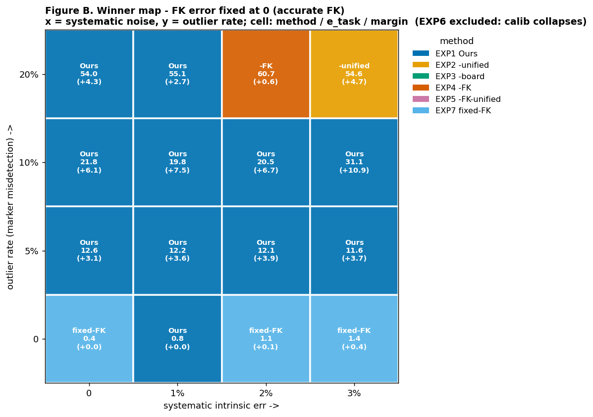
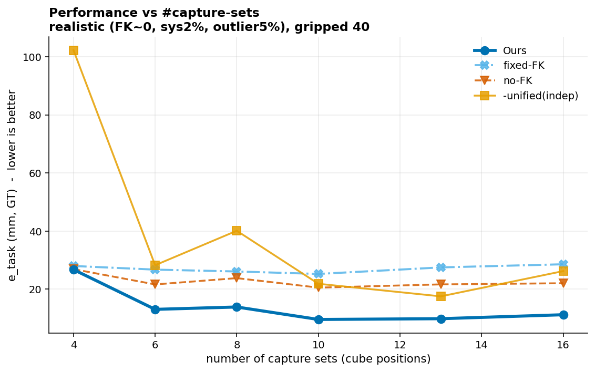

# 시뮬레이션 결과 — 7방법 ablation (GT 기준)

> ## ⚠️ 이 문서의 수치는 **구버전(불공정) 코드로 산출된 것이라 폐기 대상**입니다
>
> 2026-08-06 공정성 수정으로 아래가 모두 바뀌었습니다. **재산출 전까지 인용하지 마세요.**
>
> 1. **GT 누출 제거** — no-FK 비교군까지 초기화에 `fk_cube`(FK)와 `bTboard`(GT 보드)를
>    썼고, board-only 핸드아이는 잔차에 GT 보드를 직접 넣었습니다. 이제 모든 방법이
>    GT·FK 를 쓰지 않는 동일한 모션 기반 초기화(`_bootstrap_visual`)를 씁니다.
> 2. **재투영 열이 방법별 성능이 아니었음** — 프론트엔드 PnP 자체 잔차(`reproj_seed`)를
>    모든 방법에 똑같이 넣어 차이가 0 이었습니다. 이제 held-out 원본 2D 코너에
>    leave-one-camera-out 으로 재투영합니다.
> 3. **independent 의 rigid 정합이 예측에 적용되지 않았음** (계산만 하고 버려짐).
> 4. **Ours 재정의** — `[1,x,y]` Ridge 후보정(위치만 보정)에서 **BA 안의 공분산 가중
>    robust FK factor**(회전 포함)로 바뀌었습니다. 스크립트마다 5.0/0.5/0.0 으로
>    달랐던 anchor weight 는 제거되고 sigma_FK 가 전 실험 동결됩니다.
> 5. **프론트엔드 통일** — robust PnP(trimming)를 씬이 한 번만 돌려 모든 방법이 같은
>    코너 집합을 공유합니다. 이상치 실험이 Ours 에 유리하던 편향이 사라집니다.
> 6. **split 편향·통계** — 항상 앞 N개 조합만 쓰던 것을 seed 별 무작위 추출로 바꾸고,
>    집계를 seed 단위 + paired bootstrap 95% CI 로 바꿨습니다.
> 7. **N_reg 정직화** — 관측이 없는 카메라를 미지수에서 제외. board-only 는 이 배치에서
>    고정 카메라 3대 중 1대만 등록됩니다(구버전은 3대로 잘못 보고).
>
> 자세한 규약은 [README.md](README.md) 참조.


실측 카메라 배치·실물 마커 기하(AprilTag 큐브 6면, ChArUco 보드 11×7, 실측 K/왜곡)를 반영한
코너 수준 시뮬레이션. 렌더링 없이 3D 코너 → 2D 투영 → 픽셀노이즈/오검출 → solvePnP.
**시뮬만 GT를 알기에 진짜 정확도(e_task/e_X)를 잴 수 있다** (실데이터는 FK-프록시라 순환).

> **약식 프로토콜**: 10 sets × 6 eih + gripped 40, 4 seeds.
> 실제 규모(13 sets × 13 eih + gripped 130)는 **상대 순위 동일, 절대값만 개선**됨.
> 헤드라인 표(표 1)는 최종적으로 실제 규모로 재산출 권장.

## 방법 (7가지 ablation)

| # | FK | 캘리브 | 마커 | 이름 |
|---|---|---|---|---|
| **EXP1** | 잔차보정 | 통합 | 큐브+보드 | **Ours** |
| EXP2 | 잔차보정 | 따로 | 큐브+보드 | −통합 |
| EXP3 | 잔차보정 | 통합 | 큐브만 | −보드 |
| EXP4 | 안씀 | 통합 | 큐브+보드 | −FK |
| EXP5 | 안씀 | 따로 | 큐브+보드 | −FK−통합 |
| EXP6 | 안씀 | 통합 | 보드만 | −큐브 |
| EXP7 | 고정 | 통합(=따로) | 큐브+보드 | fixed-FK |

## 지표 쉽게 이해하기

**상황**: 고정 카메라 몇 대가 테이블을 보고, 로봇 그리퍼에도 카메라가 하나 있고, 마커 큐브가 있습니다.
캘리브 = "이것들이 서로 어디 있는지" 알아내는 것. 아래 지표로 **캘리브가 잘 됐는지 채점**합니다.

**e_task — 실전 정확도 (제일 중요)**
- 새 큐브를 테이블에 놓으면, 그 위치를 **몇 mm 오차로 맞히나.**
- 비유: 캘리브 끝난 로봇에게 "이 물건 어디 있어?" 물었을 때 틀리는 거리.
- 진짜 위치(GT)를 알아야 재므로 **시뮬만 가능.**

**e_X — 카메라를 제자리에 세웠나**
- 캘리브가 구한 **카메라 위치 + 그리퍼–카메라 관계**가 진짜와 **몇 mm / 몇 도** 다른가.
- 비유: 지도에 카메라 위치를 찍었는데 진짜와 얼마나 어긋났나.
- e_task와 차이: e_X는 "카메라를 잘 세웠나", e_task는 "그걸로 물건을 잘 찾나". 보통 같이 가지만 갈릴 수 있음. **시뮬만.**

**bTf — 카메라가 로봇 base에서 몇 mm 어긋났나 (위치만)**
- 고정 카메라 위치가 진짜와 **몇 mm** 다른가. 회전·hand-eye 빼고 **카메라 위치 오차만** 딱 떼어낸 값 (= camera→base 변환의 병진 오차).
- e_X보다 직관적: e_X는 카메라+hand-eye+회전을 섞은 평균, bTf는 **"카메라를 몇 mm 틀리게 세웠나"** 하나만. **시뮬만.**

**reproj — 사진과 앞뒤가 맞나**
- 캘리브된 카메라로 마커를 이미지에 **다시 그렸을 때, 실제 찍힌 코너와 몇 픽셀 어긋나나.**
- 비유: 내 계산대로면 마커가 여기 찍혀야 하는데 실제 사진은 몇 픽셀 옆.
- **GT 없이 잴 수 있음 → 실데이터도 가능.** 단 낮다고 정확한 건 아님(내부 일관성만) — "완전 실패 걸러내기"용.

**cross — 카메라들끼리 말이 맞나**
- 서로 다른 카메라가 **같은 큐브 위치에 얼마나 동의하나** (mm).
- 비유: 여러 사람이 "저 공 어디?" 답했을 때 답들이 얼마나 흩어지나. **실데이터도 가능.**

| 지표 | 한 줄 | 낮을수록 | 실데이터서 잴 수 있나 |
|---|---|---|---|
| **e_task** | 새 물건 위치 맞히기 | 좋음 | ✗ (시뮬 GT만) |
| **e_X** | 카메라+hand-eye 정확도 | 좋음 | ✗ (시뮬 GT만) |
| **bTf** | 카메라 위치 오차 (mm, 병진만) | 좋음 | ✗ (시뮬 GT만) |
| reproj | 사진과 앞뒤 맞기 | 좋음 | ✅ |
| cross | 카메라들끼리 일치 | 좋음 | ✅ |

---

## 📊 그림 A — 노이즈별 e_task (4패널)


| 노이즈 축 | 결과 | 해석 |
|---|---|---|
| **마커 σ** (코너 정밀도) | **Ours 최저** | 랜덤 코너노이즈에 가장 강건 |
| **계통노이즈** (intrinsic 편향) | Ours ≈ fixed 최저 | 순수 계통엔 fixed도 OK |
| **FK 오차** (랜덤) | **Ours 최악** | 보정이 틀린 FK를 쫓음 — 정직한 약점 (FK≈0이면 무관) |
| **오검출** (마커 misdetection) | **Ours 최저, no-FK 붕괴** | ⭐ 핵심 강점 |

## 📊 그림 B — 승자맵 (FK 오차=0 고정; 계통·오검출을 변화)



**읽는 법**: FK는 정확하다고 가정(FK오차=0 고정). 그 상태에서 두 노이즈를 축으로 바꿈 —
**가로축=계통노이즈(0→3%)**, **세로축=오검출(0→20%)**. 각 칸=그 조건에서 e_task 최저 방법.

- **맨 아래 행(오검출 0%)** → fixed-FK 경쟁력
- **위로 갈수록(오검출 ≥5%, 현실)** → 전 계통 레벨에서 **Ours 압도** (격차 +3~11mm)
- → **"오검출이 있으면 Ours"** 를 한 장으로. (EXP6은 캘리브 붕괴라 승자 후보에서 제외)

---

## 📋 표 1 — 현실 종합 조건 (헤드라인)

*조건: σ0.3 + 계통2% + FK≈0 + 오검출5%. 낮을수록 좋음.*

| 방법 | e_task mm | e_task ° | e_X mm | cam→base 병진 (bTf) | reproj px | cross mm |
|---|--:|--:|--:|--:|--:|--:|
| **EXP1 Ours** | **12.08** | **6.60** | 70.58 | 80.20 | **17.05** | 97.66 |
| EXP2 −통합 | 22.56 | 12.59 | **44.89** | **39.93** | 40.59 | **75.04** |
| EXP3 −보드 | 15.95 | 6.70 | 75.55 | 84.27 | 17.86 | 99.24 |
| EXP4 −FK | 25.90 | 7.26 | 73.88 | 85.46 | 19.56 | 97.65 |
| EXP5 −FK−통합 | 29.49 | 12.59 | **44.89** | **39.93** | 40.59 | **75.04** |
| EXP6 −FK−큐브 | ~~6.51~~ | 13.30 | 447.4 ⚠️ | 591.7 ⚠️ | 387.2 ⚠️ | 307.2 |
| EXP7 fixed-FK | 26.55 | 6.66 | 71.15 | 80.81 | **17.03** | 97.67 |

**bTf(카메라 위치 오차)는 e_task와 순위가 반대**: **−통합(independent)이 40mm로 최고**, Ours는 80mm.
- 이유: independent는 각 카메라를 **FK 큐브에 직접 등록** → FK가 정확(FK≈0)하니 **카메라 절대위치가 GT에 딱 묶임**.
  Ours(unified)는 soft anchor로 느슨히 묶어 **카메라 무리 전체가 절대위치로는 ~80mm 떠 있음**(내부 일관성·task는 최고).
- → **"카메라 절대위치 세우기"는 independent, "새 물건 맞히기(e_task)"는 Ours.** 목적에 맞는 지표를 봐야 함.
- (절대값 80mm은 약식 프로토콜 탓 — 실제 규모면 낮아짐. 상대 순위가 요점.)

**⚠️ EXP6(−큐브) 함정**: e_task만 보면 EXP6이 6.51로 7방법 중 **최저 → "보드만 써도 최고"로
착각하기 쉬움**. 하지만 같은 행의 **e_X=447mm, reproj=387px = 카메라 캘리브 완전 실패**.
e_task가 낮은 건, 고정 카메라가 망가져도 **그리퍼 카메라(로봇 자세로 위치를 앎)가 큐브를
대신 예측**한 탓일 뿐. → **진짜 결론: 보드만으론 카메라 캘리브 실패 = 큐브가 필요하다.**
(한 지표만 보면 안 되는 이유 — e_X까지 봐야 실패가 드러남.)

**방법론 포인트**: reproj는 fixed-FK(17.0)도 Ours(17.1)급인데 e_task는 2배 차(26.6 vs 12.1).
→ **reproj만으론 방법을 못 가린다. 실전 지표(e_task/태스크)가 필요.**

## 📋 표 1b — 조건별 e_task (mm, GT) — "어디서 누가 이기나"

| 방법 | 이상적 | 현실종합 | +FK오차 | +오검출 |
|---|--:|--:|--:|--:|
| **EXP1 Ours** | 0.00 | **12.08** | 3.82 | **21.77** |
| EXP2 −통합 | 0.00 | 22.56 | 4.20 | 62.28 |
| EXP3 −보드 | 0.00 | 15.95 | 3.84 | 27.91 |
| EXP4 −FK | 0.00 | 25.90 | **1.22** | 114.78 |
| EXP5 −FK−통합 | 0.00 | 29.49 | 2.69 | 96.60 |
| EXP6 −큐브 | 0.00 | ~~6.51~~ | ~~0.66~~ | 45.62 |
| EXP7 fixed-FK | 0.00 | 26.55 | 1.26 | 51.95 |

- **현실종합·오검출 열 → Ours 최고** (유효 방법 중)
- **FK오차 열 → Ours 약점** (FK-free가 유리) → **"FK 정확" 전제 명시 필요**

---

## 📈 촬영 셋 수 → 성능 (대표 4방식)

*대표 지표 e_task, 현실 조건(FK≈0+계통2%+오검출5%), gripped 40, **20 seeds**.*



| 방식 \ 셋 수 | 4 | 6 | 8 | 10 | 13 | 16 |
|---|--:|--:|--:|--:|--:|--:|
| **Ours** | 26.8 | 13.1 | 13.9 | **9.6** | 9.9 | 11.2 |
| fixed-FK | 28.0 | 26.7 | 26.1 | 25.3 | 27.5 | 28.6 |
| no-FK | 26.9 | 21.7 | 23.8 | 20.6 | 21.7 | 22.1 |
| −통합(indep) | 102.2 | 28.3 | 40.1 | 21.9 | 17.6 | 26.2 |

**핵심 발견**:
- **Ours만 셋↑에 크게 수렴** (26.8 → ~10mm, 6셋부터 최저) — FK 잔차보정이 셋이 많을수록 더 잘 학습됨.
- **fixed-FK는 평평(~27mm)** — 데이터를 늘려도 안 좋아짐. 오차가 **편향(계통+오검출)** 지배라, 데이터로 못 줄임.
- **no-FK도 평평(~22mm)**, −통합은 소량 셋에서 불안정(102mm).
- → **"더 많이 촬영할수록 이득 보는 건 Ours뿐"** — 논문의 실용적 강점 (데이터 효율성).

---

## 정직한 프레이밍 (논문용)

1. **Ours가 최고인 조건**: FK≈0 + (계통노이즈 or **오검출**). 사용자 실제 계획과 일치.
2. **Ours의 약점**: 순수 FK 오차엔 취약(보정이 틀린 FK를 쫓음) → **"FK를 정확히 맞춘다"는 전제**가 필수. (표 1b +FK오차 열에 정직히 표기)
3. **핵심 셀링포인트 = 오검출 강건성**: 실제 마커 검출엔 오검출(grazing angle PnP 뒤집힘 등)이 있으므로 Ours가 정당화됨.
4. **큐브 필요성**: EXP6(−큐브) 붕괴(e_X 447)로 증명.
5. **평가 지표 주의**: reproj만으론 방법을 못 가린다 → e_task(GT)/물리 태스크로 판정. 실데이터는 GT가 없어 FK-프록시가 순환이므로, **진짜 정확도 판정은 시뮬 GT가 담당**.

## 재현

저장소 루트(`rb-calibration-marker-experiment/`)에서:

```bash
cd rb-calibration-marker-experiment/Simulation

python run_paper_sim.py --seeds 4 --gripped 40    # 표1·1b·그림A·B 데이터
python viz_paper_sim.py                            # 그림·표 렌더 (results/figures, results/tables)
python run_sets_sweep.py --seeds 20                # 촬영 셋 증가 실험
python viz_sets_sweep.py                           # 셋 증가 그림

python viz_scene_paper.py                          # 시뮬 씬 그림 (fig_sim_scene_paper)
```

출력: `Simulation/results/figures/*.png`, `Simulation/results/tables/*.{json,md}`.
환경: conda `rb-calib` (numpy, scipy, opencv-python, matplotlib).
