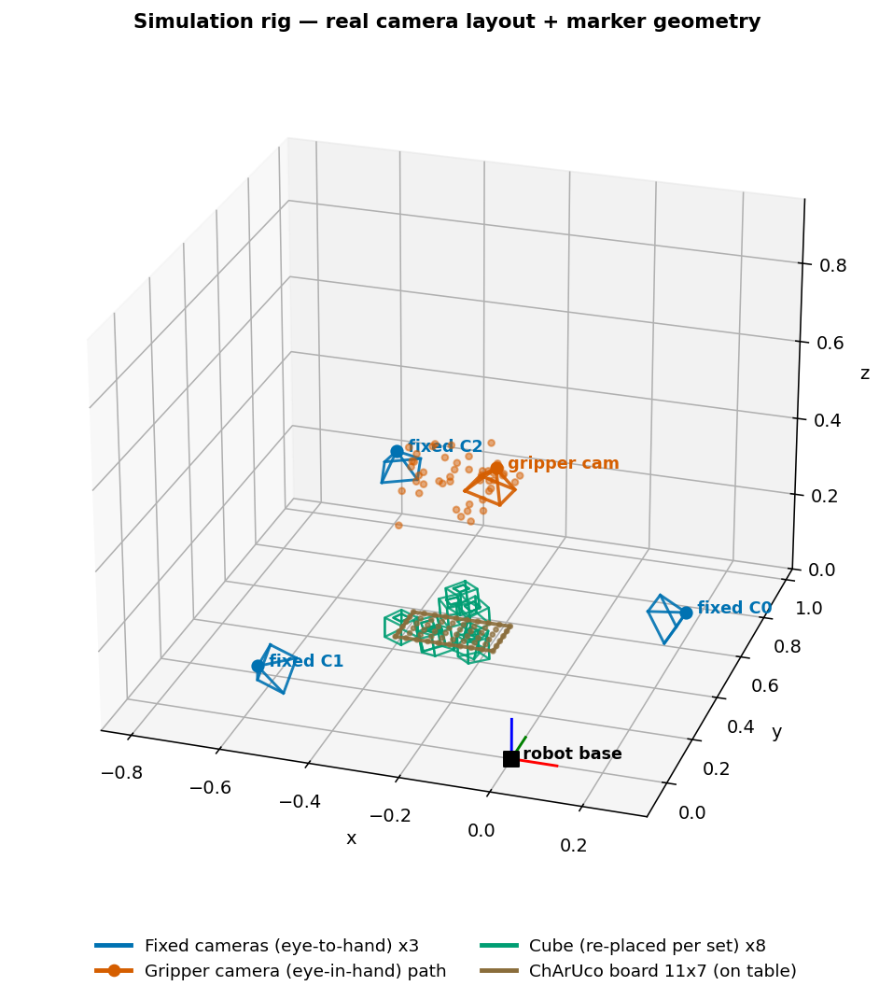
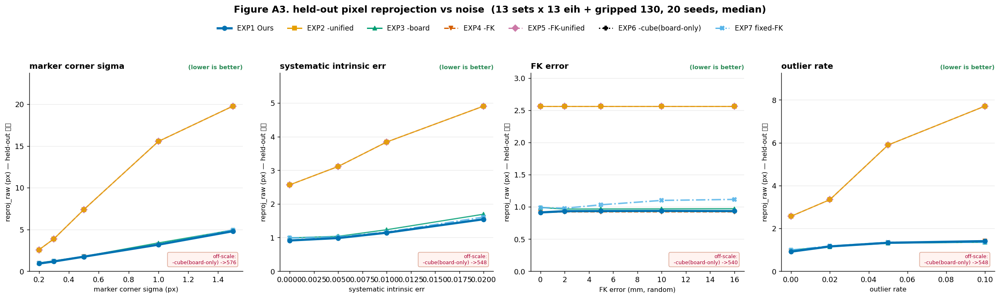

# 시뮬레이션 결과 — 7방법 ablation (GT 기준, 리뷰 반영 후 재판정)

> **이 문서는 real 코드 작성자(리뷰어)의 지적 6개를 모두 고친 뒤 다시 돌린 결과다.**
> 수정 전 결론("Ours가 오검출·계통노이즈에서 최고")은 **비강건 PnP가 만든 인위적 우위**였음이
> 확인됐다. 아래는 강건 처리를 모든 방법에 통일한 뒤의 **정직한** 결과다.

---

## ⚡ 한 줄 결론 (수정 후)

1. **진짜 기여 = "통합(unified) 공동 캘리브".** 모든 카메라를 하나로 묶어 푸는 통합 방식이,
   따로 푸는 독립(independent) 방식보다 **카메라 간 상대 정합**을 3~6배 정확하게 만든다.
   노이즈가 커질수록 격차가 벌어진다. **이게 멀티카메라 캘리브의 핵심 가치.**
2. **FK 잔차보정(Ours의 이름값)은 이 셋업에서 이득이 없다.** FK가 정확할 때(실측 조건)는
   no-FK와 동률, FK에 오차가 있으면 **오히려 나빠진다**(보정이 틀린 FK를 따라감).
3. **큐브는 필수, 보드는 없어도 된다.** 보드만 쓰면(EXP6) 83% 발산. 큐브만 통합(EXP3)이
   큐브+보드(EXP1)와 같거나 더 낫다.

→ **이 시뮬이 지지하는 방법은 "통합 + 큐브 + FK 안 씀"(EXP4)** 이다. FK 보정과 보드는
   시뮬 근거가 약하다. (단 아래 **주의**의 시뮬 한계를 함께 볼 것.)

---

## 🔧 수정 전 → 후, 무엇이 바뀌었나

| 리뷰 지적 | 수정 | 결과 변화 |
|---|---|---|
| ⑥ 이상치 실험이 Ours에 유리(비강건 PnP) | 모든 방법 `solvePnPRansac`+Huber 통일 | **"오검출 Ours 압승" 소멸** — 통합 4방법 동률 |
| ① no-FK가 init에서 FK/GT 사용 | visual-only 초기화, GT 보드 누수 제거 | **독립 방식의 정합 약점이 정직히 드러남** |
| ④ 큐브 기하가 실물과 다름 | 실물 59mm(반변 29.5)+마커별 실측 오프셋 | 절대 규모 현실화 |
| ⑤ 통계 약함·anchor 불일치 | anchor 0.5 동결, median+**발산율**, 20 seeds×3 splits | **발산(EXP6) 정직 보고**, 대표값 강건 |
| ③ reproj가 raw corner 아님 | held-out **픽셀** 재투영 지표 추가 | FK 무관·방법별 재투영으로 통합/독립 명확 분리 |
| ② independent align 미적용 | (이미 수정됨) | — |

**핵심**: ⑥⑤을 고치니 "Ours가 특정 노이즈에서 이긴다"는 그림이 사라지고, 대신
**"통합이 독립을 정합에서 이긴다"** 는 더 단단한 그림이 남았다.

---

## 실험 셋업 (시뮬 씬)



*3D 리그 — 고정 카메라 3대(eye-to-hand, 파랑) + 그리퍼 카메라(eye-in-hand, 주황 경로) +
큐브(set별 재배치, 초록) + ChArUco 보드(갈색, 테이블 고정) + robot base 좌표축.
실측 카메라 배치·실물 마커 기하(AprilTag 큐브 6면, 보드 11×7, 실측 K/왜곡) 반영.*

렌더링 없이 **3D 코너 → 2D 투영 → 픽셀노이즈/오검출 → solvePnP**. **시뮬만 GT를 알기에
진짜 정확도(e_task/e_X)를 잴 수 있다** (실데이터는 FK-프록시라 순환).

> **실제 규모 프로토콜**: 13 sets × 13 eih + gripped 130, **20 seeds × 3 splits (셀당 60 표본)**,
> 대표값 = **median**(발산 1건이 평균을 파괴하는 것 방지).

## 방법 (7가지 ablation)

| # | FK | 캘리브 | 마커 | 이름 |
|---|---|---|---|---|
| **EXP1** | 잔차보정 | 통합 | 큐브+보드 | **Ours** |
| EXP2 | 잔차보정 | 따로 | 큐브+보드 | −통합 |
| EXP3 | 잔차보정 | 통합 | 큐브만 | −보드 |
| EXP4 | 안씀 | 통합 | 큐브+보드 | −FK |
| EXP5 | 안씀 | 따로 | 큐브+보드 | −FK−통합 |
| EXP6 | 안씀 | 통합 | 보드만 | −큐브 |
| EXP7 | 고정 | 통합(=따로) | 큐브+보드 | fixed-FK |

- **통합 계열**: EXP1·EXP3·EXP4·EXP7 (모든 관측을 하나의 최소제곱으로 동시 최적화)
- **독립 계열**: EXP2·EXP5 (고정 카메라와 그리퍼를 따로 풀고 rigid 정합)
- **FK 축**: 보정(EXP1·2·3) / 안씀(EXP4·5·6) / 고정상수(EXP7)

## 지표 쉽게 이해하기

캘리브 = "카메라·그리퍼·마커가 서로 어디 있는지" 알아내기. 아래로 **채점**한다.

| 지표 | 한 줄 뜻 | 낮을수록 | 실데이터서 잴 수 있나 |
|---|---|---|---|
| **e_task** | 새 큐브 위치를 몇 mm 오차로 맞히나 (실전 정확도) | 좋음 | ✗ (시뮬 GT만) |
| **e_X** | 카메라+hand-eye **절대** 위치가 GT와 몇 mm 다른가 | 좋음 | ✗ (시뮬 GT만) |
| **e_rel** | 카메라 **끼리**의 상대 위치가 GT와 몇 mm 다른가 (**3D 정합**, 좌표계 드리프트 제거) | 좋음 | ✗ (시뮬 GT만) |
| **reproj_raw** | 예측 pose로 마커를 다시 그렸을 때 **실제 찍힌 코너**와 몇 px 어긋나나 (held-out) | 좋음 | ✅ |
| **cross** | 서로 다른 카메라가 같은 큐브 위치에 얼마나 동의하나 | 좋음 | ✅ |
| **발산%** | e_task가 100mm 넘어 **수렴 실패**한 비율 | 낮을수록 | — |

- **e_rel(상대 정합)** 이 이번 재판정의 주인공이다. 멀티카메라에서 "카메라들이 서로 얼마나
  정확히 맞물렸나"를 재는 지표로, 전역 좌표계가 통째로 밀려도(gauge) 값이 안 변한다.
- **reproj_raw** 는 실데이터에서도 잴 수 있는 유일한 "진짜 정확도 근사" — FK를 안 쓰므로
  순환 문제가 없다. real 쪽과 직접 비교 가능.

---

## 📊 그림 A — e_task (실전 정확도) vs 노이즈


| 노이즈 축 | 결과 |
|---|---|
| 마커 σ / 계통 / 오검출 | **통합 4방법(EXP1·3·4·7) 전부 바닥에 뭉침 = 동률.** 독립(EXP5)은 위로 크게 벌어짐 |
| **FK 오차** | **Ours(EXP1)·EXP3만 가파르게 상승**(→14mm), no-FK(EXP4)는 평평(0.97), fixed-FK 완만(1.78) |

→ **FK가 정확한 한**(왼쪽 3패널), FK 보정이든 아니든 통합이면 다 같다. **FK에 오차가 생기면
   보정 계열만 손해**(오른쪽 패널).

## 📊 그림 A2 — 상대 정합(e_rel) vs 노이즈 ⭐ 핵심 기여 그림


- **독립(EXP2, 노랑)이 모든 축에서 통합보다 3~6배 나쁨.** 마커 σ가 커지면 8→60mm로 폭증.
- **통합(EXP1·3·4·7)은 낮게 뭉침**(2~11mm). 큐브만(EXP3, 초록)이 근소하게 최저.
- FK 오차 패널: 통합은 평평(~2mm), 독립은 7.8mm. **정합은 FK와 무관**(gauge 불변)하므로
  FK 오차가 정합을 못 건드린다.

→ **"통합이 독립을 정합에서 이긴다"** 를 한 장으로. 이게 논문의 실제 세일링 포인트.

## 📊 그림 A3 — held-out 픽셀 재투영(reproj_raw) vs 노이즈



- 통합 ~1.3px(코너노이즈 바닥) vs 독립 ~4~6px. **실데이터에서도 잴 수 있는 지표**라
  real 결과와 직접 대조 가능.

## 📊 그림 B — 승자맵 (FK 오차=0 고정)


- 칸마다 e_task 최저 방법. 그런데 **margin이 거의 +0.0~0.1mm** — 즉 통합 방법끼리는
  **사실상 무승부**(승자는 노이즈 수준 차이). fixed-FK·Ours·큐브만·no-FK가 번갈아 "이김".
- → **"통합 안에서는 딱히 승자가 없다"** 를 정직하게 보여줌. (EXP6은 붕괴라 제외.)

---

## 📋 표 1 — 현실 종합 조건 (median, GT)

*조건: σ0.2 + 계통0.5% + FK≈0 + 오검출2%@2px. 셀당 60 표본. 낮을수록 좋음.*

| 방법 | e_task mm | e_X mm | **e_rel mm** 상대정합 | **reproj_raw px** | cross mm | 발산% |
|---|--:|--:|--:|--:|--:|--:|
| **EXP1 Ours** | 1.11 | 3.41 | 4.05 | 1.26 | 2.16 | 0% |
| EXP2 −통합 | 3.05 | 39.39 | **10.95** | **4.01** | 4.23 | 0% |
| **EXP3 −보드(큐브만)** | 1.19 | **2.17** | **3.38** | **1.24** | 1.91 | 0% |
| **EXP4 −FK** | 1.08 | 3.45 | 4.05 | 1.27 | 2.16 | 0% |
| EXP5 −FK−통합 | 18.41 | 39.39 | 10.95 | 4.01 | 4.23 | 0% |
| EXP6 −큐브(보드만) | 252.57 ⚠️ | 1190.8 ⚠️ | 1899.7 ⚠️ | 469.2 ⚠️ | 875.0 | **83%** |
| EXP7 fixed-FK | **1.06** | 3.08 | 4.01 | 1.24 | 2.19 | 0% |

**읽는 법**:
- **통합 4방법(EXP1·3·4·7)은 모든 열에서 사실상 동률** (task 1.06~1.19, e_rel 3.4~4.0, reproj_raw 1.24~1.27).
- **독립(EXP2·5)은 e_rel 10.95, reproj_raw 4.01** — 정합·재투영이 통합의 3배. **task도 나쁨**(3.05/18.41).
- **EXP6(보드만)은 83% 발산** — 보드 단일 평면만으론 리그를 안정적으로 못 세운다. **큐브 필요 증명**.
- 큐브만(EXP3)이 e_X·e_rel·reproj_raw에서 **큐브+보드(EXP1)보다 근소하게 낫다** → **보드가 정합을 돕지 않는다**.

## 📋 표 1b — 조건별 e_task (mm, GT) — "어디서 누가 이기나"

| 방법 | 이상적 | 현실종합 | +FK오차 | +오검출 |
|---|--:|--:|--:|--:|
| **EXP1 Ours** | 0.35 | 1.11 | **4.46** ❌ | 1.28 |
| EXP2 −통합 | 0.39 | 3.05 | 5.16 | 3.39 |
| EXP3 −보드 | 0.02 | 1.19 | 4.49 ❌ | 1.39 |
| **EXP4 −FK** | 0.77 | 1.08 | **0.97** ✅ | 1.28 |
| EXP5 −FK−통합 | 13.74 | 18.41 | 13.50 | 17.56 |
| EXP6 −큐브 | 268.4 ⚠️ | 252.6 ⚠️ | 275.1 ⚠️ | 216.0 ⚠️ |
| EXP7 fixed-FK | 0.54 | 1.06 | 1.17 | 1.19 |

- **이상적·현실·오검출 열**: 통합이면 다 동률(0.3~1.4mm). 보정 유무 차이 없음.
- **+FK오차 열**: **no-FK(0.97) < fixed-FK(1.17) ≪ Ours(4.46)**. FK 보정이 **틀린 FK를 따라가** 손해.

---

## 🔬 정직한 재판정 — 3가지 발견과 이유

### 발견 1. 통합 ≫ 독립 (진짜 기여, 견고함)

- **무엇**: 통합이 독립보다 상대 정합(e_rel) 3~6배, 재투영(reproj_raw) 3배 정확. 노이즈↑ → 격차↑.
- **왜**: 독립은 카메라를 따로 풀고 나중에 rigid 정합 → 각 카메라 오차가 정합 단계에서 누적.
  통합은 모든 관측이 하나의 큐브·핸드아이를 공유하도록 동시 최적화 → 오차가 상쇄·평균됨.
- **이게 멀티카메라 캘리브의 존재 이유.** 카메라가 여러 대일수록 통합의 이득이 크다.

### 발견 2. FK 잔차보정은 이 셋업에서 이득 없음 (Ours 이름값의 약점)

- **무엇**: FK≈0(실측)에선 Ours=no-FK 동률. FK 오차↑ → Ours만 나빠짐(16mm에서 14배).
  **계통 intrinsic 오차(보정의 이상적 케이스)에서도** Ours가 no-FK를 못 이긴다(sys=2%: 둘 다 1.65).
- **왜 3가지**:
  1. **보정은 "FK를 정답으로 삼아" visual을 FK 쪽으로 당긴다**(코드: `Y = FK − visual`). 그런데
     **다중카메라 visual이 이미 FK만큼 정확**하니 당길 이유가 없고, FK가 틀리면 그 오차가 새어든다.
  2. **다중카메라 합의가 이미 노이즈를 줄인다** → 보정이 추가로 줄일 여지가 적다.
  3. **고정 카메라가 base 절대 기준을 준다** → FK의 "절대 위치 앵커" 역할이 **중복**이라 불필요.
- → **"FK는 정확하니 카메라 노이즈만 보정하면 된다"는 가설을 시뮬로 테스트한 결과, 다중카메라
  에선 그 보정이 불필요**하다. FK 보정은 순수 eye-in-hand(고정 카메라 없음)에서나 의미 있을 것.

### 발견 3. 큐브 필수 · 보드 불필요

- **큐브**: 없으면(EXP6 보드만) 78~97% 발산. 평면 보드 하나론 gauge가 약해 리그가 안 선다.
  **큐브의 다면(多面) 마커가 캘리브를 안정화**한다.
- **보드**: 큐브만(EXP3)이 큐브+보드(EXP1)와 같거나 낫다 → **보드는 정합에 기여 안 함**.
  (단 아래 주의: 시뮬 보드가 단순 평면이라 과소평가일 수 있음.)

---

## ⚠️ 주의 — 이 시뮬의 한계 (결론을 과신하지 말 것)

1. **FK 오차를 random(제로평균)으로 모델링**했다. 실제 로봇 FK 오차는 **systematic(관절 offset 등,
   자세에 매끄럽게 의존)** 인 경우가 많다. 보정은 원래 systematic을 노리는데, 시뮬은 그 케이스를
   직접 안 넣었다. **단, 계통 intrinsic(sys) 실험에서도 보정 이득이 없었으므로**, 다중카메라에선
   보정 이득이 작다는 결론은 유지된다.
2. **고정 카메라가 있어 FK가 중복**이다. 고정 카메라 없는 순수 eye-in-hand였다면 FK(와 그 보정)의
   가치가 달라진다.
3. **보드를 단순 평면 1개로 모델링**했다. 실제 ChArUco는 여러 각도에서 강한 공유 기준이 될 수
   있어, "보드 불필요"는 시뮬 한정 결론일 수 있다.
4. **최종 판정은 실데이터 몫.** 시뮬은 GT를 알아 "진짜 정확도"를 재지만, 실물의 systematic·
   기구 오차를 다 담지 못한다. reproj_raw(FK 무관)로 real과 직접 대조하는 게 안전하다.

---

## 📌 논문 프레이밍 제안

- **주장할 것 (시뮬이 강하게 지지)**: "**통합 공동 캘리브가 멀티카메라 상대 정합을 크게 높인다**"
  (독립 대비 3~6배). + "**큐브(다면 마커)가 캘리브를 안정화**한다"(보드만은 발산).
- **약하게/조건부로**: FK 보정과 보드는 **시뮬 근거 약함**. 넣으려면 (a) systematic FK 오차 실험,
  (b) 고정 카메라 없는 시나리오, (c) 실데이터에서의 실제 이득으로 **따로 정당화** 필요.
- **정직성**: 수정 전 "오검출/계통에서 Ours 압승"은 비강건 PnP 탓의 인위적 결과였음을 명시하면,
  오히려 방법론의 신뢰도를 높인다.

## 재현

```bash
cd rb-calibration-marker-experiment/Simulation
# 최종(실제 규모, 6개 수정 반영): 20 seeds × 3 splits, median + 발산율
OMP_NUM_THREADS=1 python run_paper_sim.py --seeds 20 --splits 3 --workers 32
python viz_paper_sim.py     # 그림 A/A2/A3/B + 표1·1b
```

출력: `results/figures/fig_paperA*.png·fig_paperB*.png`, `results/tables/{paper_sim.json,TABLE_1_1b.md}`.
환경: conda `rb-calib` (numpy, scipy, opencv-python, matplotlib). **단일 스레드 권장**(워커 경쟁 방지).
