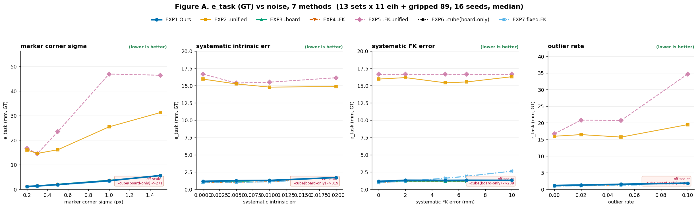
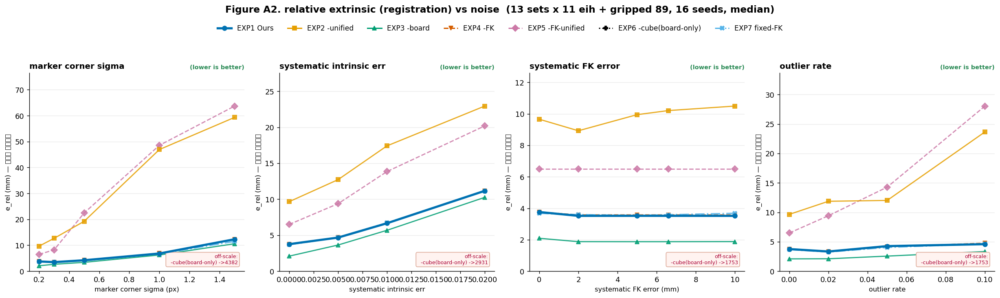

# 시뮬레이션 결과 — 7방법 ablation (GT 기준, real 충실 재판정)

> 리뷰어(real 코드 작성자)의 6개 지적을 모두 고치고, **시뮬을 실측(real) 구성에 맞춘 뒤**
> 다시 돌린 결과다. 특히 **FK 보정을 real 파이프라인 방식(de-bias)으로 재구현**했다.
> 대조·반영 내역은 [SIM_VS_REAL_CHECKLIST.md](SIM_VS_REAL_CHECKLIST.md), 리뷰 수정은
> [SIM_REVIEW_FIXES.md](SIM_REVIEW_FIXES.md).

---

## ⚡ 한 줄 결론

1. **진짜 기여 = 통합(unified) 공동 캘리브.** 모든 카메라를 하나로 묶어 푸는 통합이 따로 푸는
   독립(independent)보다 상대 정합(e_rel) 3~5배, 재투영 3배 정확. **멀티카메라 캘리브의 핵심.**
2. **큐브 필수.** 보드만 쓰면(EXP6) 81% 발산. 큐브의 다면 마커가 캘리브를 안정화한다.
3. **FK 보정(Ours)의 가치 = fixed-FK 대비 안전.** 실측 FK 는 systematic 오차가 있는데
   (리뷰어 확인: 180° flip + 오프셋 + 6~17mm), **raw FK 를 그대로 믿는 fixed-FK 는 이때 무너지고
   (FK 없을 때 0.96 → systematic FK 10mm 에서 2.63mm)**, **de-bias 하는 Ours 는 평평(~1.3mm)**하다.
4. **단, Ours 는 no-FK 를 이기지 못한다.** 고정 카메라 3대의 vision(~1.2mm)이 이미 FK prior(~2.6mm)보다
   정확해 FK 가 중복이다. Ours ≈ no-FK(둘 다 안전). → **"FK 를 쓸 거면 반드시 보정(Ours), 안 쓰면 no-FK."**

---

## 🔧 real 에 맞춘 것 (SIM_VS_REAL_CHECKLIST 요약)

| 항목 | 반영 |
|---|---|
| **FK 오차** | ≈0/random → **systematic**(상수 오정렬 + per-set 잔차, 실측 ~6.6mm). FK 있음/없음 둘 다 실험 |
| **FK 보정 방식** | "예측을 FK 로 당김"(틀림) → **real 방식 de-bias**: `T_delta=robust_avg(inv(FK)@vision)` 로 FK 를 vision 에 정렬 후 앵커 |
| **카메라 intrinsic** | 평균 K 1개 → **카메라별 개별 실측 K 4개** (fixed=cam0/1/3, grip=cam2) |
| **프로토콜** | 13/130 → 실측 **11 eih/set · 89 gripped** |
| 하향각 | 27° 유지 (물리 리그 재조정 확인) |
| 큐브·보드 기하 | 이미 실측 정본(config.py)과 일치 |

---

## 방법 (7가지 ablation)

| # | FK | 캘리브 | 마커 | 이름 |
|---|---|---|---|---|
| **EXP1** | de-bias 보정 | 통합 | 큐브+보드 | **Ours** |
| EXP2 | de-bias 보정 | 따로 | 큐브+보드 | −통합 |
| EXP3 | de-bias 보정 | 통합 | 큐브만 | −보드 |
| EXP4 | 안씀 | 통합 | 큐브+보드 | −FK |
| EXP5 | 안씀 | 따로 | 큐브+보드 | −FK−통합 |
| EXP6 | 안씀 | 통합 | 보드만 | −큐브 |
| EXP7 | raw 고정 | 통합 | 큐브+보드 | fixed-FK |

- **FK 보정(corr)**: raw FK 를 vision 으로 **de-bias**(상수 오정렬 제거) 후 앵커 (= real `set_cube_center_prior`).
- **fixed-FK**: raw FK 를 그대로 하드 상수로 사용 (de-bias 안 함) — systematic FK 에 취약한 대조군.

## 지표

| 지표 | 뜻 | 실데이터서 측정 |
|---|---|---|
| **e_task** | 새 큐브 위치 예측 오차 (mm) — 실전 정확도 | ✗ (시뮬 GT) |
| **e_X** | 카메라+hand-eye 절대 오차 (mm) | ✗ |
| **e_rel** | 카메라 상대 정합 (mm, gauge 불변) — 3D 정합 | ✗ |
| **reproj_raw** | held-out 픽셀 재투영 (px) — FK 무관 | ✅ |
| **발산%** | e_task>100mm(수렴 실패) 비율 | — |

---

## 📋 표 1 — 현실 종합 조건 (realistic, FK 없음/정확) — median, GT

*13 sets(11 train + 2 test) × 11 eih + gripped 89, 16 seeds × 3 splits. σ0.2 + 계통0.5% + 오검출2%.*

| 방법 | e_task mm | e_X mm | **e_rel mm** | **reproj_raw px** | cross mm | 발산% |
|---|--:|--:|--:|--:|--:|--:|
| **EXP1 Ours** | 1.35 | 3.64 | 4.42 | 1.33 | 2.21 | 0% |
| EXP2 −통합 | 15.80 | 50.17 | **15.29** | **8.15** | 9.10 | 0% |
| **EXP3 −보드(큐브만)** | 1.30 | **2.56** | **3.15** | **1.24** | 1.91 | 0% |
| **EXP4 −FK** | 1.14 | 3.37 | 4.49 | 1.29 | 2.18 | 0% |
| EXP5 −FK−통합 | 19.82 | 56.01 | 11.58 | 4.25 | 4.36 | 0% |
| EXP6 −큐브(보드만) | 208.9 ⚠️ | 1191 ⚠️ | 1971 ⚠️ | 487 ⚠️ | 933 | **81%** |
| **EXP7 fixed-FK** | **1.08** | 2.96 | 4.35 | 1.29 | 2.19 | 0% |

- **통합 4방법(EXP1·3·4·7) 동률** (task 1.08~1.35, e_rel 3.2~4.5). **독립(EXP2·5)은 e_rel 11~15, reproj 4~8** — 3~5배 나쁨.
- **EXP6(보드만) 81% 발산** — 큐브 필요 증명.
- FK 정확할 땐 **fixed-FK 가 근소 최고**(1.08) — 정확한 FK 를 하드 상수로 쓰는 게 이득.

## 📋 표 1c — FK 없음 vs FK 있음 (systematic 6.6mm, 실측형) — e_task mm ⭐

*같은 조건에서 FK systematic 오차만 추가. 보정이 이를 얼마나 잡나.*

| 방법 | FK 없음 | FK 있음 | Δ |
|---|--:|--:|--:|
| **EXP1 Ours (de-bias)** | 1.35 | 1.56 | **+0.22** ✅ |
| **EXP4 −FK** | 1.14 | 1.21 | +0.07 ✅ |
| **EXP7 fixed-FK (raw)** | 1.08 | 2.31 | **+1.23** ❌ |

→ **fixed-FK 는 systematic FK 에 2배 악화, Ours(de-bias)·no-FK 는 거의 불변.** de-bias 가 systematic FK 를 제거.

## 📊 그림 A(fk_sys 패널) — systematic FK sweep



| systematic FK (mm) | 0 | 2 | 5 | 6.6 | 10 |
|---|--:|--:|--:|--:|--:|
| **Ours (de-bias)** | 1.15 | 1.31 | 1.30 | 1.31 | 1.30 |
| **no-FK** | 0.99 | 1.12 | 1.12 | 1.12 | 1.12 |
| **fixed-FK (raw)** | 0.96 | 1.18 | 1.60 | 1.88 | **2.63** |

- **fixed-FK 만 우상향**(0.96→2.63). Ours·no-FK 는 평평 → **보정이 systematic FK 를 잡는다**.
- Ours 가 no-FK 를 못 이기는 건, 고정 카메라 vision 이 이미 FK 보다 정확해 FK 가 중복이기 때문.

## 📊 그림 A2 — 상대 정합(e_rel) vs 노이즈 ⭐ 핵심 기여



독립(EXP2/5)이 모든 노이즈축에서 통합보다 정합 3~5배 나쁨, 노이즈↑ 격차↑. **"통합 ≫ 독립"** 을 한 장으로.

## 📈 학습 set 수 sweep (Ours/no-FK/fixed-FK, test=2 고정)

*학습 set 3~11 개, gripped 비례 축소. "데이터 적을 때 FK 가 no-FK 를 이기나?" → 아니오.*

**FK 없음** e_task(mm):
| 방식 \ 학습 set | 3 | 5 | 7 | 9 | 11 |
|---|--:|--:|--:|--:|--:|
| Ours | 1.46 | 1.91 | 1.28 | 1.65 | 1.39 |
| no-FK | 1.36 | 1.71 | 1.12 | 1.41 | 1.31 |
| fixed-FK | 1.20 | 1.43 | 1.12 | 1.46 | 1.17 |

**FK 있음(systematic)** e_task(mm):
| 방식 \ 학습 set | 3 | 5 | 7 | 9 | 11 |
|---|--:|--:|--:|--:|--:|
| Ours | 1.82 | 1.69 | 1.34 | 1.68 | 1.45 |
| no-FK | 1.60 | 1.60 | 1.21 | 1.41 | 1.28 |
| fixed-FK | 2.62 | 2.46 | 2.20 | 2.39 | 2.08 |

- **set 을 3개까지 줄여도 Ours 가 no-FK 를 못 이긴다** — 고정 카메라 3대가 vision 을 계속 강하게 유지.
- **단 fixed-FK 는 systematic FK 에서 항상 최악**(2.1~2.6). → FK 쓸 거면 반드시 de-bias.

---

## 🔬 정직한 재판정

1. **통합 ≫ 독립** (견고). 정합·재투영에서 3~5배. 멀티카메라의 존재 이유.
2. **큐브 필수** (EXP6 81% 발산). 보드는 정합에 기여 안 함(EXP3 큐브만 ≥ EXP1).
3. **FK 보정(de-bias)의 가치 = fixed-FK 구제.** 실측 systematic FK 에서 fixed-FK 는 무너지고
   Ours 는 평평. "FK 를 쓸 거면 raw(fixed-FK) 말고 de-bias(Ours)."
4. **Ours 는 no-FK 를 이기지 못함** (이 셋업에선). 고정 카메라 vision(~1.2mm) > FK prior(~2.6mm)라
   FK 가 중복. set 을 줄여도 마찬가지. → **no-FK 도 똑같이 안전**하고 더 단순.

## ⚠️ 주의 (시뮬 한계)

- **고정 카메라 3대가 vision 을 강하게** 만들어 FK 를 중복화한다. 고정 카메라가 적거나(1~2대)
  없으면(순수 eye-in-hand) FK 의 가치가 커질 수 있다 — **미검증(다음 실험 후보: 카메라 수 sweep)**.
- 실측 vision(~2mm) ≈ FK(~3mm) 이라 real 에선 FK 가 시뮬보다 조금 더 유용할 수 있다.
- 최종 판정은 실데이터 몫. reproj_raw(FK 무관)로 real 과 직접 대조 가능.

## 📌 논문 프레이밍 제안

- **강하게**: "통합 공동 캘리브가 멀티카메라 정합을 크게 높인다" + "큐브가 캘리브를 안정화".
- **FK 보정**: "실측 FK 는 systematic 오차가 있어 raw 사용(fixed-FK)은 위험 → de-bias 필수".
  단 **no-FK 대비 우위는 이 셋업(고정 카메라 충분)에선 없음**을 정직히 밝히거나, 카메라 수를 줄인
  조건에서 우위를 별도 입증.

## 재현

```bash
cd Simulation
OMP_NUM_THREADS=1 python run_paper_sim.py --seeds 16 --splits 3 --workers 32  # 표·그림 데이터
python viz_paper_sim.py                                                        # 그림 A/A2/A3/B + 표
OMP_NUM_THREADS=1 python run_sets_sweep.py --seeds 24 --workers 16             # 학습 set 수 sweep
```
환경: conda `rb-calib` (numpy, scipy, opencv-python, matplotlib). 단일 스레드 권장(워커 경쟁 방지).
