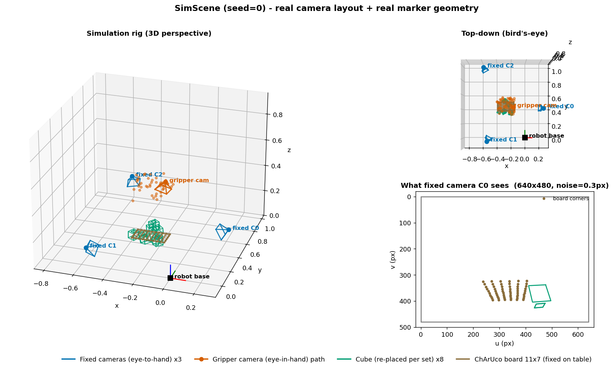
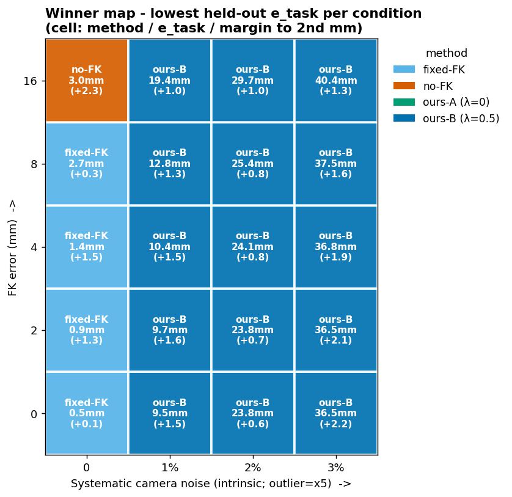
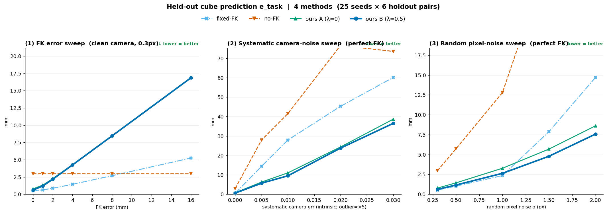

# 어떤 조건에서 어떤 방법이 이기나 — 4방법 시뮬레이션 비교

> **역사적 결과 / 재실행 필요:** 아래 수치는 legacy soft-anchor 실험에서 생성됐다. 현재 기본
> `corr`는 Step3형 de-bias + guarded blend이며 `anchor_weight`를 사용하지 않는다.

**FK 사용 방식 4가지**(fixed-FK / no-FK / ours-A / ours-B)를 **FK 오차 × 카메라 노이즈(랜덤·계통)** 조건에서
전수 비교하여, "각 조건에서 held-out 큐브 예측(e_task)이 가장 낮은 방법"을 구했다.

## TL;DR

- **fixed-FK**는 **FK가 정확하고 카메라 계통노이즈가 0인 이상적 코너에서만** 최고다.
- **ours-B**는 **카메라 계통노이즈가 조금이라도(≥1%) 있으면 거의 전 영역에서 최고**다.
- 실제 카메라 인지 오차는 계통적(intrinsic·왜곡·검출 편향)이므로, **현실 조건에서는 ours-B가 사실상 항상 최고**다.
- **ours-A(anchor=0)가 ours-B(anchor=0.5)를 이긴 경우는 시뮬 36개 조건 중 0개** — 약한 anchor가 항상 안전하게 낫다.

---

## 1. 실험 셋업

실측 카메라 배치·실물 마커 기하(AprilTag 큐브 6면, ChArUco 보드 11×7, 실측 K/왜곡)를 반영한 코너 수준
시뮬레이션. 렌더링 없이 3D 코너 → 2D 투영 → 픽셀노이즈 → solvePnP 로 관측을 생성한다.



*좌: 3D 원근 리그 — 고정 카메라 3대(eye-to-hand) + 그리퍼 카메라(eye-in-hand) 경로 + 큐브(set별 재배치) + ChArUco 보드 + robot base 좌표축. 우상: 위에서 본 배치(bird's-eye). 우하: 고정 카메라 C0가 실제로 보는 2D 투영(보드 코너 + 큐브 면, 0.3px 픽셀노이즈) — solvePnP 입력.*

### 비교한 4방법

| 방법 | 1차: 큐브 FK를 | 2차 보정 | anchor λ |
|---|---|---|---|
| **fixed-FK** | 하드 고정 | ✗ | (하드) |
| **no-FK** | 안 씀(자유변수) | ✗ | 0 |
| **ours-A** | 안 씀(자유, anchor=0) | ✓ | 0 |
| **ours-B** | soft anchor | ✓ | 0.5 |

- **ours-A vs no-FK 차이** = 2차 FK 잔차보정 유무
- **ours-A vs ours-B 차이** = 1차 soft anchor(λ) 유무
- 세 방법 모두 eye-in-hand FK(`bTg`)는 공통 사용(gauge 앵커). 차이는 **큐브 위치 FK(`fk_cube`)를 어떻게 쓰나**.

### 조건 축

- **FK 오차**: `fk_noise_mm` ∈ {0, 1, 2, 4, 8, 16} (로봇 큐브 prior 부정확도)
- **카메라 노이즈 — 두 종류로 분리**
  - **랜덤**: `sigma_px` ∈ {0.3, 0.5, 1.0, 1.5, 2.0} (평균으로 소거됨)
  - **계통**: `intrinsic_err` ∈ {0, 0.5%, 1%, 2%, 3%} (+ outlier = ×5) (소거 안 됨)

측정: held-out 큐브 예측 RMSE **e_task** (20 seeds × 6 holdout 쌍 평균).

---

## 2. 승자 히트맵



| FK오차 ↓ \ 계통노이즈 → | **0** | 1% | 2% | 3% |
|---|---|---|---|---|
| **16mm** | no-FK | **ours-B** | **ours-B** | **ours-B** |
| **8mm** | fixed-FK | **ours-B** | **ours-B** | **ours-B** |
| **4mm** | fixed-FK | **ours-B** | **ours-B** | **ours-B** |
| **2mm** | fixed-FK | **ours-B** | **ours-B** | **ours-B** |
| **0mm** | fixed-FK | **ours-B** | **ours-B** | **ours-B** |

→ **계통노이즈 열(≥1%)은 전부 ours-B.** fixed-FK는 **계통노이즈=0인 맨 왼쪽 열에서만** 승리.

---

## 3. Sweep 곡선 (각 축 격리)



### (1) FK 오차 sweep — 카메라 깨끗(랜덤 0.3px)

| e_task (mm) | fk=0 | 1 | 2 | 4 | 8 | 16 |
|---|---|---|---|---|---|---|
| fixed-FK | **0.52** | **0.64** | **0.87** | **1.44** | **2.68** | 5.25 |
| no-FK | 2.97 | 2.97 | 2.97 | 2.97 | 2.97 | **2.97** |
| ours-A | 0.78 | 1.32 | 2.26 | 4.30 | 8.48 | 16.91 |
| ours-B | 0.61 | 1.20 | 2.17 | 4.24 | 8.44 | 16.87 |

**카메라가 완벽하면 fixed-FK 승.** FK가 극단(16mm)이면 no-FK가 앞선다.

### (2) 계통 카메라노이즈 sweep — FK 완벽

| e_task (mm) | 0 | 0.5% | 1% | 2% | 3% |
|---|---|---|---|---|---|
| fixed-FK | **0.52** | 14.37 | 27.93 | 45.30 | 60.16 |
| no-FK | 2.97 | 27.91 | 41.55 | 76.64 | 73.56 |
| ours-A | 0.78 | 6.27 | 11.02 | 24.36 | 38.66 |
| ours-B | 0.61 | **5.69** | **9.50** | **23.77** | **36.50** |

**fixed-FK가 0.5→60mm로 붕괴**, ours-B가 매 지점 최저. **계통오차엔 ours 압도.**

### (3) 랜덤 픽셀 sweep — FK 완벽

| e_task (mm) | 0.3 | 0.5 | 1.0 | 1.5 | 2.0 |
|---|---|---|---|---|---|
| fixed-FK | **0.52** | **1.03** | **2.35** | 7.88 | 14.70 |
| no-FK | 2.97 | 5.72 | 12.81 | 29.96 | 41.03 |
| ours-A | 0.78 | 1.43 | 3.27 | 5.68 | 8.61 |
| ours-B | 0.61 | 1.16 | 2.63 | **4.78** | **7.57** |

저노이즈는 fixed, **1px 넘으면 ours-B 역전**(변동성엔 보정+자유큐브가 유리).

전체 지표(gTc/e_X/reproj)는 [fig_ww_metrics.png](results/figures/fig_ww_metrics.png) 참고.

---

## 4. ours-A vs ours-B — 약한 anchor가 항상 낫다

시뮬 36개 조건 전수 비교:

| sweep | 평균 A(λ=0) | 평균 B(λ=0.5) | B 우세폭 |
|---|---|---|---|
| FK오차 | 5.68 | **5.59** | 0.09mm (거의 동률) |
| 계통노이즈 | 16.22 | **15.21** | 1.00mm |
| 랜덤px | 3.95 | **3.35** | 0.60mm |

**ours-A가 ours-B를 이긴 경우: 0 / 36.** 카메라가 깨끗할 땐 거의 동률(0.09mm)이지만, 노이즈가 있으면 B가 확실히 낫다.

**이유(bias-variance)**: soft anchor는 정규화다. 카메라 노이즈로 흔들리는 큐브 추정의 **분산을 줄이는 이득**과, 부정확한 FK로 당겨 **편향을 더하는 손해**가 상충한다. **λ=0.5는 약해서 손해는 미미하고 이득은 챙기므로** 항상 A 이상. (이론적으로 FK가 극단적으로 나쁘고 카메라가 완벽하면 A가 앞설 수 있으나, 테스트 범위에선 미관측.)

---

## 5. 실데이터와의 일치

실데이터(data/session, CP_C1)에서 anchor_weight를 sweep한 결과:

| anchor λ | held-out e_task (down+fk) |
|---|---|
| 0 (ours-A) | 2.59 mm |
| **0.5 (ours-B)** | **2.06 mm** ← 최저 |
| 5.0 (실코드 기본) | 3.41 mm |

- 실데이터도 **λ≈0.5가 최적**, λ=0(A)보다 나음 → 시뮬과 일치.
- (앞서 "A가 B를 이겼다"고 본 실험은 B의 λ가 5.0이라 과한 경우였다. λ=0.5면 B가 A를 이긴다.)
- 실측 카메라 reproj rms 0.24–0.32px에 **계통 성분**(intrinsic·왜곡)이 있으므로, 히트맵상 **계통노이즈 열 = ours-B 영역**에 해당.

---

## 6. 결론 및 권고

| 방법 | 이기는 조건 | 실제 해당? |
|---|---|---|
| **fixed-FK** | FK 정확 **&** 카메라 계통노이즈 0 | ✗ (이상적 코너뿐) |
| **ours-B** | 계통노이즈 존재(현실) → 거의 전 영역 | ✅ |
| **no-FK** | FK 극단 오차 + 카메라 완벽 | ✗ (극단 코너) |

- **논문 메시지**: 완벽 FK·이상 카메라에서는 fixed-FK로 충분하나, 실제 시스템의 **FK 오차 + 카메라 계통노이즈** 아래에서 fixed는 붕괴하고, **ours(soft anchor + 잔차보정)만이 전 조건에서 강건**하다.
- **실용 권고**: anchor는 **작게(λ≈0.5)**. 실코드 기본값 5.0은 최적을 지나쳐 있으니 하향 검토 권장.

---

## 재현

```bash
# 실험 (4방법 × 조건 sweep, CPU 병렬)
python run_which_wins.py --seeds 20 --workers 18 --pairs 6
# 그림
python viz_which_wins.py       # fig_ww_grid / fig_ww_sweeps / fig_ww_metrics
python viz_scene_paper.py       # fig_sim_scene_paper (씬 그림)
```

결과 데이터: `results/tables/ww_{fk,sys,rand,grid}.json`
