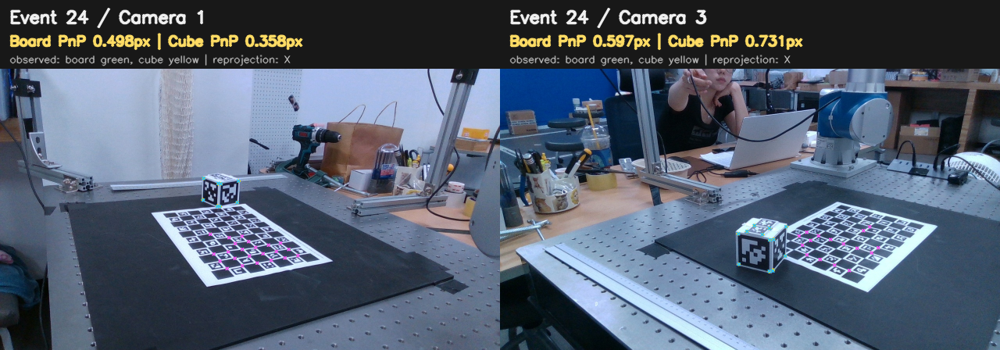

# Session04 Board–Cube Relative Pose and Intrinsic Validation

> **상태: 완화 완료 · 원인 제거 미완료 · 외부 GT 필요**
>
> 알려진 detector·metadata 오류와 geometry 정의는 수정·검증했습니다. 남은 direct-PnP 충돌은 joint corner-reprojection에서 완화하지만, 외부 GT 없이 어느 target의 절대 자세가 더 정확한지 판별하거나 원인이 제거됐다고 주장하지 않습니다.

## 결론

Frozen 영상 topology는 OpenCV checker square `11×7`이고 내부 ChArUco corner는 `10×6=60`입니다. 따라서 checker 전체 폭 275 mm는 square length `25.0 mm`와 일치합니다. 여기서 10은 checker square 수가 아니라 내부 corner column 수입니다.
Cube도 본체 59×59×57 mm, +Z 돌출부 2 mm, side marker 51 mm, top marker 25 mm 정의와 실물이 일치합니다. 기존 3D corner 좌표는 이미 top marker plane z=+29.5 mm와 side marker center z=-1 mm로 이 구조를 표현하므로 Cube geometry scale 불일치 가설도 기각합니다.

확인된 소프트웨어 문제는 Cube 기본 검출기의 corner refinement가 꺼져 있어 AprilTag corner가 주로 정수 pixel로 고정되던 것입니다. AprilTag 전용 refinement를 기본값으로 적용하고 frozen manifest를 재생성했습니다. 또한 manifest marker_ids가 정렬되면서 4-corner block 순서와 달라지던 metadata 오류도 수정했습니다.

수정 전후 translation 충돌 RMSE는 `17.299 → 10.808 mm`, Cube held-out transfer는 `4.247 → 2.882 px`입니다.
남은 target-dependent 충돌은 한 target의 extrinsic을 정답처럼 선택하거나 Board/Cube pose를 단순 평균해서 없애지 않습니다. Calibration은 두 target이 공유하는 camera 변수를 corner reprojection으로 joint solve하고, direct PnP 결과는 diagnostic으로만 사용합니다.

학습 관측에서 두 target을 강제로 맞추면 Board 쪽에 `1.008899`를 곱하는 수치가 나오지만, 이는 물리적 Board 보정값이 아니라 target 간 systematic disagreement를 흡수한 유효값입니다. 25.0 mm nominal square에 대입하면 `25.222 mm`입니다.
RGB-D가 독립적으로 암시한 Board/Cube 상대 scale 중앙값은 `1.016485`입니다.
학습 relative-transform translation 충돌 RMSE는 scale 적용 시 `10.808 → 6.261 mm` (`42.1%` 감소)입니다.

## 먼저 구분할 수치

| 수치 | 의미 | 사용 여부 |
|---|---|---|
| `10.808 mm` | Board-only PnP와 Cube-only PnP가 계산한 동일 고정 카메라 변환의 target-dependent 불일치 | 진단 및 single-target 결과 공개 금지 gate |
| `1.947 mm` | Board가 추정한 카메라 변환의 held-out 자기 일관성 | 보조 지표 |
| `3.515 mm` | Cube가 추정한 카메라 변환의 held-out 자기 일관성 | 보조 지표 |
| 외부 GT 오차 | 알려진 실제 카메라 자세와 추정값의 차이 | 현재 없음 |

따라서 `10.808 mm`는 최종 joint calibration의 translation 정확도도, 실제 카메라 위치의 절대 오차도 아닙니다. 서로 다른 두 target이 동일 물리량에 대해 얼마나 충돌하는지 보여주는 독립 direct-PnP 진단값입니다. 외부 GT 없이 이 값으로 절대 정확도를 주장하지 않습니다.

| Camera | Board baseline | Cube baseline | 보정 전 차이 | 보정 후 차이 | 회전 차이 |
|---|---:|---:|---:|---:|---:|
| cam1 | 973.441 mm | 984.992 mm | 12.952 mm | 6.556 mm | 0.527° |
| cam3 | 1006.008 mm | 1012.197 mm | 8.115 mm | 5.952 mm | 0.382° |

이 scale은 train event만 사용하며 held-out, Robot FK, Hand–Eye, 외부 GT는 사용하지 않습니다. 실측 Board와 모순되므로 config, calibration 입력, 공식 결과에는 적용하지 않습니다.

## Cube geometry 가설 분해

Board의 25.0 mm를 물리 기준으로 고정한 뒤 Cube object point의 서로 다른 성분만 train 관측에서 scale scan한 반사실적 진단입니다. Cube 실측값과 모순되므로 아래 scale은 config에 적용하지 않습니다.

| 가설 | 최적 scale | 충돌 RMSE | Cube held-out transfer |
|---|---:|---:|---:|
| 현재 Cube config | 1.000000 | 10.808 mm | 2.882 px |
| Cube 전체 geometry | 0.991140 | 6.206 mm | 2.882 px |
| 모든 marker 크기만 | 0.981629 | 5.697 mm | 3.665 px |
| 51 mm side marker 크기만 | 0.979508 | 5.790 mm | 4.190 px |
| 25 mm top marker 크기만 | 0.951518 | 8.398 mm | 2.306 px |
| marker 중심 배치 반경만 | 0.985325 | 6.593 mm | 2.302 px |

## 동일 Event 직접 비교

| Camera | Event 수 | 병진 차이 median | 회전 차이 median | Board→Cube scale median |
|---|---:|---:|---:|---:|
| cam1 | 9 | 11.928 mm | 0.655° | 1.009667 |
| cam3 | 5 | 8.098 mm | 0.513° | 1.005745 |

## Intrinsic / Distortion 비교

각 intrinsic 후보로 train 상대 자세를 다시 계산하고 같은 held-out에서 자기 target 재투영을 평가했습니다.

| Intrinsic | Board-fit→Board px/mm | Cube-fit→Cube px/mm | cam1 conflict | cam3 conflict |
|---|---:|---:|---:|---:|
| `charuco_calibrated_KD` | 1.414 px / 1.947 mm | 2.882 px / 3.515 mm | 12.952 mm | 8.115 mm |
| `factory_KD` | 1.490 px / 2.071 mm | 5.259 px / 6.614 mm | 4.881 mm | 4.957 mm |
| `factory_K_charuco_D` | 1.727 px / 2.384 mm | 3.786 px / 4.300 mm | 9.319 mm | 4.708 mm |
| `charuco_K_zero_distortion` | 1.377 px / 1.907 mm | 5.186 px / 6.344 mm | 8.828 mm | 8.251 mm |

현재 ChArUco K/D는 factory K/D보다 Board 자기 일관성이 비슷하거나 좋고 Cube 자기 일관성은 더 좋습니다. 왜곡을 0으로 두어도 target scale 차이가 사라지지 않으므로 intrinsic/distortion이 1차 원인은 아닙니다. 현재 K/D를 유지합니다.

## RGB-D 절대 Scale 교차검증

PnP가 예측한 target 표면 깊이와 같은 RGB pixel의 aligned RealSense depth를 비교했습니다. `pred/meas < 1`이면 현재 object geometry가 실제보다 작게 정의되었을 가능성이 큽니다.

| Target | Camera | 관측 수 | Pred/Measured depth | 보정 암시 scale | 깊이 bias |
|---|---:|---:|---:|---:|---:|
| Board | cam0 | 24 | 0.982088 | 1.018239 | -12.091 mm |
| Board | cam1 | 26 | 0.971637 | 1.029191 | -16.873 mm |
| Board | cam3 | 19 | 0.965162 | 1.036096 | -21.703 mm |
| Cube | cam0 | 13 | 0.993850 | 1.006188 | -4.547 mm |
| Cube | cam1 | 13 | 0.987808 | 1.012343 | -7.988 mm |
| Cube | cam3 | 13 | 0.981073 | 1.019293 | -12.860 mm |

이 검사는 color PnP와 별도 depth stream을 사용하므로 상대카메라 baseline 비교와 다른 증거입니다. 다만 RealSense depth 자체의 systematic bias가 있어 실측 Board/Cube 치수보다 우선할 수 없으며 geometry config 변경 근거로 사용하지 않습니다.
Camera별 Board/Cube 상대 scale은 `cam0=1.011977, cam1=1.016643, cam3=1.016485`이며, target 종류에 공통인 depth bias를 상쇄한 값입니다.

### 기존 ChArUco 재보정 기록

| Camera | RMS | 사용 views | 판정 |
|---|---:|---:|---|
| cam0 | 0.322 px | 10 | coverage 제한 |
| cam1 | 0.360 px | 9 | coverage 제한 |
| cam2 | 0.215 px | 12 | 충분 |
| cam3 | 0.332 px | 14 | 충분 |

cam0·cam1은 각각 10·9 views라 coverage가 제한적이지만, Session04 held-out 비교에서는 현재 K/D를 폐기할 근거가 없습니다. 추가 intrinsic 촬영 없이 가능한 검증은 완료했습니다.

## Camera 1·3 Board/Cube Overlay

초록/노랑 점은 frozen 관측, X는 해당 target PnP 재투영입니다. 두 target 모두 개별 영상 안에서는 잘 맞으므로 gross한 단일-frame corner ordering 오류 가능성은 낮습니다. 다만 이 오버레이만으로 실물 marker 중심 거리나 Board/Cube 절대 치수를 확정할 수는 없습니다.

## 재발 방지 계약

- Frozen manifest schema: `post_capture_observation_manifest_v2`
- Board/Cube geometry와 SHA-256은 meta/manifest 사이에서 일치해야 로드됨
- Board corner ID→3D point와 Cube marker ID→4-corner block 순서가 다르면 즉시 실패
- Board detector는 `CORNER_REFINE_NONE`, Cube detector는 명시된 refinement mode를 기록
- Direct PnP 충돌 `10.808 mm`는 single-target extrinsic 공개 금지 신호이며 shared-camera joint solve를 강제

## 남은 오차의 처리

수정 후에도 10.808 mm의 target-dependent 차이가 남습니다. PnP solver를 바꾸어도 최선이 10.692 mm이고 stereoCalibrate도 12.928 mm이므로 solver 선택 문제는 아닙니다.

Factory K/D에서는 충돌이 약 4.9 mm로 줄지만 Cube held-out transfer가 2.882 px에서 5.259 px로 악화됩니다. 따라서 factory intrinsic으로 즉시 교체하지 않습니다. 남은 차이는 현재 intrinsic의 제한된 view coverage와 planar/non-planar target별 localization bias가 섞인 것으로 판단하며, 다양한 거리·화면 위치의 새 intrinsic 촬영 또는 외부 GT 없이는 어느 K/D가 절대적으로 옳은지 식별할 수 없습니다.
