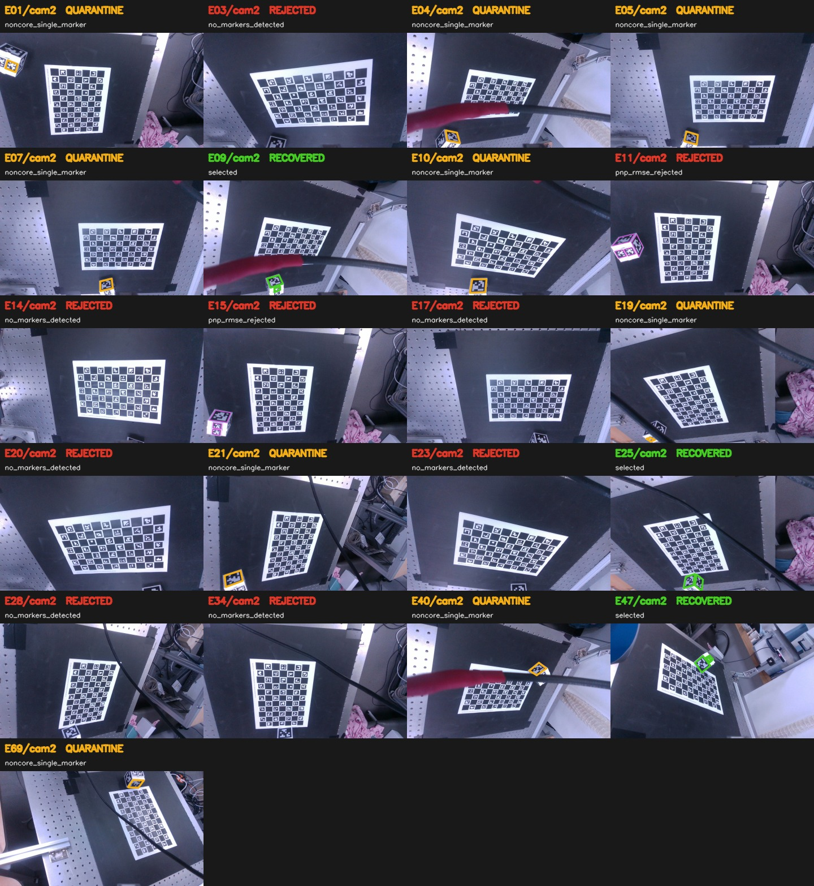

# Step2b Post-capture Observation Filter

- Session: `/Users/woo/Documents/GitHub/Robot-Lab/rb-calibration-marker-experiment/data/session04/calib_train`
- 생성 시각(UTC): `2026-08-26T13:57:24.688243+00:00`
- 원본 RGB/meta/intrinsics: **수정하지 않음**
- Calibration 입력: 재검출 결과의 native-pixel 2D corner를 manifest에 고정

## 결과 요약

| 항목 | Standard | Strict |
|---|---:|---:|
| Cube 선택 관측 | 99 | 90 |
| Board 선택 관측 | 147 | 146 |
| Cube 재검출 복구 | 3 | 3 |

Cube standard disposition: `quarantine` 9, `recovered` 3, `rejected` 9, `selected` 96

## 정책

- `standard`: cube는 서로 다른 방향의 non-coplanar face 2개 이상, positive-depth PnP, RMSE ≤ 3.0 px. Board는 ChArUco corner ≥ 4.
- `strict`: 같은 기하 조건에 RMSE ≤ 2.0 px, inlier fraction ≥ 0.9, Board corner ≥ 12.
- `recovered`: 기본 검출은 core가 아니었지만 offline 재검출로 standard를 통과.
- `quarantine`: corner/PnP는 있으나 face 또는 임계값 부족. 자동 calibration에서 제외.
- `rejected`: marker 미검출, 영상 오류, PnP 실패/초과 등으로 frozen corner가 없음.

## 시각 검토

Standard의 recovered/quarantine/rejected cube 관측 21개를 한 장에 모았습니다.
초록은 recovered, 주황은 quarantine, 빨강은 rejected입니다. Rejected에 보라색 선이 있으면 촬영 당시 meta에 저장된 구형 검출 corner입니다.



## Standard 제외 cube 관측

| Event/camera | 결과 | Marker IDs | Faces | RMSE | 이유 |
|---|---|---|---|---:|---|
| E01/cam2 | quarantine | 1 | +Z | 0.291 px | `noncore_single_marker` |
| E03/cam2 | rejected | — | — | — | `no_markers_detected` |
| E04/cam2 | quarantine | 3 | +Y | 0.349 px | `noncore_single_marker` |
| E05/cam2 | quarantine | 3 | +Y | 0.356 px | `noncore_single_marker` |
| E07/cam2 | quarantine | 3 | +Y | 0.099 px | `noncore_single_marker` |
| E10/cam2 | quarantine | 3 | +Y | 0.125 px | `noncore_single_marker` |
| E11/cam2 | rejected | 0, 1, 3, 4 | +Y, +Z, -X | 5.418 px | `pnp_rmse_rejected` |
| E14/cam2 | rejected | — | — | — | `no_markers_detected` |
| E15/cam2 | rejected | 0, 1, 5 | +Z, -Y | 17.185 px | `pnp_rmse_rejected` |
| E17/cam2 | rejected | — | — | — | `no_markers_detected` |
| E19/cam2 | quarantine | 0 | +Z | 0.465 px | `noncore_single_marker` |
| E20/cam2 | rejected | — | — | — | `no_markers_detected` |
| E21/cam2 | quarantine | 4 | -X | 1.372 px | `noncore_single_marker` |
| E23/cam2 | rejected | — | — | — | `no_markers_detected` |
| E28/cam2 | rejected | — | — | — | `no_markers_detected` |
| E34/cam2 | rejected | — | — | — | `no_markers_detected` |
| E40/cam2 | quarantine | 3 | +Y | 1.084 px | `noncore_single_marker` |
| E69/cam2 | quarantine | 4 | -X | 0.104 px | `noncore_single_marker` |

## Standard 제외 board 관측

| Event/camera | Corner 수 | 상태 | 이유 |
|---|---:|---|---|
| E30/cam3 | 0 | no_charuco_or_below_4_corners | `no_charuco_or_below_4_corners` |
| E36/cam3 | 0 | no_charuco_or_below_4_corners | `no_charuco_or_below_4_corners` |
| E42/cam3 | 0 | no_charuco_or_below_4_corners | `no_charuco_or_below_4_corners` |
| E60/cam3 | 0 | no_charuco_or_below_4_corners | `no_charuco_or_below_4_corners` |
| E80/cam0 | 0 | no_charuco_or_below_4_corners | `no_charuco_or_below_4_corners` |
| E82/cam0 | 0 | no_charuco_or_below_4_corners | `no_charuco_or_below_4_corners` |
| E82/cam3 | 0 | no_charuco_or_below_4_corners | `no_charuco_or_below_4_corners` |
| E83/cam3 | 0 | no_charuco_or_below_4_corners | `no_charuco_or_below_4_corners` |
| E85/cam3 | 0 | no_charuco_or_below_4_corners | `no_charuco_or_below_4_corners` |

## Strict에서 추가 제외되는 관측

Standard는 통과했지만 strict RMSE/inlier/board-corner 기준에서 추가 제외되는 관측입니다.

| Target | Event/camera | Corner 수 | RMSE | Inlier | 이유 |
|---|---|---:|---:|---:|---|
| board | E86/cam3 | 11 | — | — | `charuco_corners_below_12` |
| cube | E00/cam0 | 16 | 2.031 px | 0.938 | `pnp_rmse_above_2px` |
| cube | E00/cam2 | 12 | 2.397 px | 0.917 | `pnp_rmse_above_2px` |
| cube | E06/cam3 | 8 | 1.646 px | 0.875 | `inlier_fraction_below_0.9` |
| cube | E08/cam2 | 16 | 2.366 px | 0.938 | `pnp_rmse_above_2px` |
| cube | E18/cam3 | 8 | 1.580 px | 0.875 | `inlier_fraction_below_0.9` |
| cube | E27/cam2 | 16 | 2.447 px | 0.938 | `pnp_rmse_above_2px` |
| cube | E38/cam2 | 16 | 2.264 px | 0.938 | `pnp_rmse_above_2px` |
| cube | E66/cam3 | 8 | 2.128 px | 0.875 | `pnp_rmse_above_2px` |
| cube | E77/cam2 | 16 | 2.847 px | 0.938 | `pnp_rmse_above_2px` |

## 재촬영 후보

현재 calibration 계약에서 cube를 사용하지 않는 gripped-cube event는 재촬영 후보에서 제외했습니다.

| Event | Set | 우선순위 | 남아 있는 board cameras | 이유 |
|---:|---:|---|---|---|
| 01 | 0 | medium | cam2 | missing_standard_core_cube; board observation remains usable |
| 03 | 0 | medium | cam2 | missing_standard_core_cube; board observation remains usable |
| 04 | 0 | medium | cam2 | missing_standard_core_cube; board observation remains usable |
| 05 | 0 | medium | cam2 | missing_standard_core_cube; board observation remains usable |
| 07 | 1 | medium | cam2 | missing_standard_core_cube; board observation remains usable |
| 10 | 1 | medium | cam2 | missing_standard_core_cube; board observation remains usable |
| 11 | 1 | medium | cam2 | missing_standard_core_cube; board observation remains usable |
| 14 | 2 | medium | cam2 | missing_standard_core_cube; board observation remains usable |
| 15 | 2 | medium | cam2 | missing_standard_core_cube; board observation remains usable |
| 17 | 2 | medium | cam2 | missing_standard_core_cube; board observation remains usable |
| 19 | 3 | medium | cam2 | missing_standard_core_cube; board observation remains usable |
| 20 | 3 | medium | cam2 | missing_standard_core_cube; board observation remains usable |
| 21 | 3 | medium | cam2 | missing_standard_core_cube; board observation remains usable |
| 23 | 3 | medium | cam2 | missing_standard_core_cube; board observation remains usable |
| 28 | 4 | medium | cam2 | missing_standard_core_cube; board observation remains usable |
| 34 | 5 | medium | cam2 | missing_standard_core_cube; board observation remains usable |
| 40 | 6 | medium | cam2 | missing_standard_core_cube; board observation remains usable |
| 69 | 11 | medium | cam2 | missing_standard_core_cube; board observation remains usable |

## Event별 선택 결과

| Event | Set | Block | Standard | Cube cams | Board cams | Strict |
|---:|---:|---|---|---|---|---|
| 00 | 0 | A_placement | selected_cube_and_board | cam0, cam1, cam2, cam3 | cam0, cam1, cam2, cam3 | selected_cube_and_board |
| 01 | 0 | A_placement | board_only | — | cam2 | board_only |
| 02 | 0 | A_placement | selected_cube_and_board | cam2 | cam2 | selected_cube_and_board |
| 03 | 0 | A_placement | board_only | — | cam2 | board_only |
| 04 | 0 | A_placement | board_only | — | cam2 | board_only |
| 05 | 0 | A_placement | board_only | — | cam2 | board_only |
| 06 | 1 | A_placement | selected_cube_and_board | cam0, cam1, cam2, cam3 | cam0, cam1, cam2, cam3 | selected_cube_and_board |
| 07 | 1 | A_placement | board_only | — | cam2 | board_only |
| 08 | 1 | A_placement | selected_cube_and_board | cam2 | cam2 | board_only |
| 09 | 1 | A_placement | selected_cube_and_board | cam2 | cam2 | selected_cube_and_board |
| 10 | 1 | A_placement | board_only | — | cam2 | board_only |
| 11 | 1 | A_placement | board_only | — | cam2 | board_only |
| 12 | 2 | A_placement | selected_cube_and_board | cam0, cam1, cam2, cam3 | cam0, cam1, cam2, cam3 | selected_cube_and_board |
| 13 | 2 | A_placement | selected_cube_and_board | cam2 | cam2 | selected_cube_and_board |
| 14 | 2 | A_placement | board_only | — | cam2 | board_only |
| 15 | 2 | A_placement | board_only | — | cam2 | board_only |
| 16 | 2 | A_placement | selected_cube_and_board | cam2 | cam2 | selected_cube_and_board |
| 17 | 2 | A_placement | board_only | — | cam2 | board_only |
| 18 | 3 | A_placement | selected_cube_and_board | cam0, cam1, cam2, cam3 | cam0, cam1, cam2, cam3 | selected_cube_and_board |
| 19 | 3 | A_placement | board_only | — | cam2 | board_only |
| 20 | 3 | A_placement | board_only | — | cam2 | board_only |
| 21 | 3 | A_placement | board_only | — | cam2 | board_only |
| 22 | 3 | A_placement | selected_cube_and_board | cam2 | cam2 | selected_cube_and_board |
| 23 | 3 | A_placement | board_only | — | cam2 | board_only |
| 24 | 4 | A_placement | selected_cube_and_board | cam0, cam1, cam2, cam3 | cam0, cam1, cam2, cam3 | selected_cube_and_board |
| 25 | 4 | A_placement | selected_cube_and_board | cam2 | cam2 | selected_cube_and_board |
| 26 | 4 | A_placement | selected_cube_and_board | cam2 | cam2 | selected_cube_and_board |
| 27 | 4 | A_placement | selected_cube_and_board | cam2 | cam2 | board_only |
| 28 | 4 | A_placement | board_only | — | cam2 | board_only |
| 29 | 4 | A_placement | selected_cube_and_board | cam2 | cam2 | selected_cube_and_board |
| 30 | 5 | A_placement | selected_cube_and_board | cam0, cam1, cam2, cam3 | cam0, cam1, cam2 | selected_cube_and_board |
| 31 | 5 | A_placement | selected_cube_and_board | cam2 | cam2 | selected_cube_and_board |
| 32 | 5 | A_placement | selected_cube_and_board | cam2 | cam2 | selected_cube_and_board |
| 33 | 5 | A_placement | selected_cube_and_board | cam2 | cam2 | selected_cube_and_board |
| 34 | 5 | A_placement | board_only | — | cam2 | board_only |
| 35 | 5 | A_placement | selected_cube_and_board | cam2 | cam2 | selected_cube_and_board |
| 36 | 6 | A_placement | selected_cube_and_board | cam0, cam1, cam2, cam3 | cam0, cam1, cam2 | selected_cube_and_board |
| 37 | 6 | A_placement | selected_cube_and_board | cam2 | cam2 | selected_cube_and_board |
| 38 | 6 | A_placement | selected_cube_and_board | cam2 | cam2 | board_only |
| 39 | 6 | A_placement | selected_cube_and_board | cam2 | cam2 | selected_cube_and_board |
| 40 | 6 | A_placement | board_only | — | cam2 | board_only |
| 41 | 6 | A_placement | selected_cube_and_board | cam2 | cam2 | selected_cube_and_board |
| 42 | 7 | A_placement | selected_cube_and_board | cam0, cam1, cam2, cam3 | cam0, cam1, cam2 | selected_cube_and_board |
| 43 | 7 | A_placement | selected_cube_and_board | cam2 | cam2 | selected_cube_and_board |
| 44 | 7 | A_placement | selected_cube_and_board | cam2 | cam2 | selected_cube_and_board |
| 45 | 7 | A_placement | selected_cube_and_board | cam2 | cam2 | selected_cube_and_board |
| 46 | 7 | A_placement | selected_cube_and_board | cam2 | cam2 | selected_cube_and_board |
| 47 | 7 | A_placement | selected_cube_and_board | cam2 | cam2 | selected_cube_and_board |
| 48 | 8 | A_placement | selected_cube_and_board | cam0, cam1, cam2, cam3 | cam0, cam1, cam2, cam3 | selected_cube_and_board |
| 49 | 8 | A_placement | selected_cube_and_board | cam2 | cam2 | selected_cube_and_board |
| 50 | 8 | A_placement | selected_cube_and_board | cam2 | cam2 | selected_cube_and_board |
| 51 | 8 | A_placement | selected_cube_and_board | cam2 | cam2 | selected_cube_and_board |
| 52 | 8 | A_placement | selected_cube_and_board | cam2 | cam2 | selected_cube_and_board |
| 53 | 8 | A_placement | selected_cube_and_board | cam2 | cam2 | selected_cube_and_board |
| 54 | 9 | A_placement | selected_cube_and_board | cam0, cam1, cam2, cam3 | cam0, cam1, cam2, cam3 | selected_cube_and_board |
| 55 | 9 | A_placement | selected_cube_and_board | cam2 | cam2 | selected_cube_and_board |
| 56 | 9 | A_placement | selected_cube_and_board | cam2 | cam2 | selected_cube_and_board |
| 57 | 9 | A_placement | selected_cube_and_board | cam2 | cam2 | selected_cube_and_board |
| 58 | 9 | A_placement | selected_cube_and_board | cam2 | cam2 | selected_cube_and_board |
| 59 | 9 | A_placement | selected_cube_and_board | cam2 | cam2 | selected_cube_and_board |
| 60 | 10 | A_placement | selected_cube_and_board | cam0, cam1, cam2, cam3 | cam0, cam1, cam2 | selected_cube_and_board |
| 61 | 10 | A_placement | selected_cube_and_board | cam2 | cam2 | selected_cube_and_board |
| 62 | 10 | A_placement | selected_cube_and_board | cam2 | cam2 | selected_cube_and_board |
| 63 | 10 | A_placement | selected_cube_and_board | cam2 | cam2 | selected_cube_and_board |
| 64 | 10 | A_placement | selected_cube_and_board | cam2 | cam2 | selected_cube_and_board |
| 65 | 10 | A_placement | selected_cube_and_board | cam2 | cam2 | selected_cube_and_board |
| 66 | 11 | A_placement | selected_cube_and_board | cam0, cam1, cam2, cam3 | cam0, cam1, cam2, cam3 | selected_cube_and_board |
| 67 | 11 | A_placement | selected_cube_and_board | cam2 | cam2 | selected_cube_and_board |
| 68 | 11 | A_placement | selected_cube_and_board | cam2 | cam2 | selected_cube_and_board |
| 69 | 11 | A_placement | board_only | — | cam2 | board_only |
| 70 | 11 | A_placement | selected_cube_and_board | cam2 | cam2 | selected_cube_and_board |
| 71 | 11 | A_placement | selected_cube_and_board | cam2 | cam2 | selected_cube_and_board |
| 72 | 12 | A_placement | selected_cube_and_board | cam0, cam1, cam2, cam3 | cam0, cam1, cam2, cam3 | selected_cube_and_board |
| 73 | 12 | A_placement | selected_cube_and_board | cam2 | cam2 | selected_cube_and_board |
| 74 | 12 | A_placement | selected_cube_and_board | cam2 | cam2 | selected_cube_and_board |
| 75 | 12 | A_placement | selected_cube_and_board | cam2 | cam2 | selected_cube_and_board |
| 76 | 12 | A_placement | selected_cube_and_board | cam2 | cam2 | selected_cube_and_board |
| 77 | 12 | A_placement | selected_cube_and_board | cam2 | cam2 | board_only |
| 78 | 13 | B_eyetohand | board_only | — | cam0, cam1, cam3 | board_only |
| 79 | 13 | B_eyetohand | board_only | — | cam0, cam1, cam3 | board_only |
| 80 | 13 | B_eyetohand | board_only | — | cam1, cam3 | board_only |
| 81 | 13 | B_eyetohand | board_only | — | cam0, cam1, cam3 | board_only |
| 82 | 13 | B_eyetohand | board_only | — | cam1 | board_only |
| 83 | 13 | B_eyetohand | board_only | — | cam0, cam1 | board_only |
| 84 | 13 | B_eyetohand | board_only | — | cam0, cam1, cam3 | board_only |
| 85 | 13 | B_eyetohand | board_only | — | cam0, cam1 | board_only |
| 86 | 13 | B_eyetohand | board_only | — | cam0, cam1, cam3 | board_only |
| 87 | 13 | B_eyetohand | board_only | — | cam0, cam1, cam3 | board_only |
| 88 | 13 | B_eyetohand | board_only | — | cam0, cam1, cam3 | board_only |
| 89 | 13 | B_eyetohand | board_only | — | cam0, cam1, cam3 | board_only |
| 90 | 13 | B_eyetohand | board_only | — | cam0, cam1, cam3 | board_only |

## Calibration에서 frozen manifest 사용

```bash
python3 Step3_calibration.py \
  --root_folder /Users/woo/Documents/GitHub/Robot-Lab/rb-calibration-marker-experiment/data/session04/calib_train \
  --intrinsics_dir /Users/woo/Documents/GitHub/Robot-Lab/rb-calibration-marker-experiment/intrinsics \
  --observation-manifest /Users/woo/Documents/GitHub/Robot-Lab/rb-calibration-marker-experiment/data/session04/calib_out/capture_filter/Step2b_observation_manifest.json \
  --observation-filter-policy standard
```

`strict` 비교 시 마지막 값만 `strict`로 바꾸면 됩니다. Manifest를 사용할 때 Step3/Table1은 detector를 다시 실행하지 않으며, meta/intrinsics/선택 RGB의 SHA-256이 달라지면 중단합니다.

## 산출물

- `Step2b_observation_manifest.json`: frozen 2D/3D corner, 정책, source SHA-256
- `Step2b_selected_observations.csv`: standard 선택 관측
- `Step2b_quarantine_observations.csv`: 복구되지 않은 저품질/planar 관측
- `Step2b_rejected_observations.csv`: 검출/PnP 실패 관측
- `Step2b_retake_candidates.csv`: event 단위 재촬영 후보
- `Step2b_review_overlay.jpg`: 육안 검토 contact sheet
