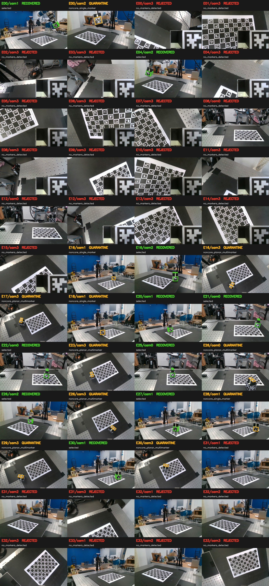

# 04 Post-capture Observation Filter

- Session: `/home/sstone/rb-calibration-marker-experiment/data/session11_zeus_handheld_floor_wrist_meta_0909/calib_train`
- 생성 시각(UTC): `2026-09-14T07:19:56.901430+00:00`
- 원본 RGB/meta/intrinsics: **수정하지 않음**
- Calibration 입력: 재검출 결과의 native-pixel 2D corner를 manifest에 고정
- Cube corner refinement: `apriltag`

## 결과 요약

| 항목 | Standard | Strict |
|---|---:|---:|
| Cube 선택 관측 | 110 | 110 |
| Board 선택 관측 | 172 | 167 |
| Cube 재검출 복구 | 10 | 10 |

Cube standard disposition: `quarantine` 11, `recovered` 10, `rejected` 63, `selected` 100

## 정책

- `standard`: cube는 서로 다른 방향의 non-coplanar face 2개 이상, positive-depth PnP, RMSE ≤ 3.0 px. Board는 ChArUco corner ≥ 4.
- `strict`: 같은 기하 조건에 RMSE ≤ 2.0 px, inlier fraction ≥ 0.9, Board corner ≥ 12.
- `recovered`: 기본 검출은 core가 아니었지만 offline 재검출로 standard를 통과.
- `quarantine`: corner/PnP는 있으나 face 또는 임계값 부족. 자동 calibration에서 제외.
- `rejected`: marker 미검출, 영상 오류, PnP 실패/초과 등으로 frozen corner가 없음.

## 시각 검토

Standard의 recovered/quarantine/rejected cube 관측 48개를 한 장에 모았습니다.
초록은 recovered, 주황은 quarantine, 빨강은 rejected입니다. Rejected에 보라색 선이 있으면 촬영 당시 meta에 저장된 구형 검출 corner입니다.



## Standard 제외 cube 관측

| Event/camera | 결과 | Marker IDs | Faces | RMSE | 이유 |
|---|---|---|---|---:|---|
| E00/cam2 | quarantine | 2 | +X | 0.090 px | `noncore_single_marker` |
| E00/cam3 | rejected | — | — | — | `no_markers_detected` |
| E01/cam3 | rejected | — | — | — | `no_markers_detected` |
| E02/cam3 | rejected | — | — | — | `no_markers_detected` |
| E03/cam3 | rejected | — | — | — | `no_markers_detected` |
| E04/cam3 | rejected | — | — | — | `no_markers_detected` |
| E05/cam3 | rejected | — | — | — | `no_markers_detected` |
| E06/cam3 | rejected | — | — | — | `no_markers_detected` |
| E07/cam3 | rejected | — | — | — | `no_markers_detected` |
| E08/cam0 | rejected | — | — | — | `no_markers_detected` |
| E08/cam3 | rejected | — | — | — | `no_markers_detected` |
| E09/cam3 | rejected | — | — | — | `no_markers_detected` |
| E10/cam3 | rejected | — | — | — | `no_markers_detected` |
| E11/cam3 | rejected | — | — | — | `no_markers_detected` |
| E12/cam0 | rejected | — | — | — | `no_markers_detected` |
| E12/cam3 | rejected | — | — | — | `no_markers_detected` |
| E13/cam3 | rejected | — | — | — | `no_markers_detected` |
| E14/cam3 | rejected | — | — | — | `no_markers_detected` |
| E15/cam3 | rejected | — | — | — | `no_markers_detected` |
| E16/cam1 | quarantine | 3 | +Y | 0.043 px | `noncore_single_marker` |
| E16/cam3 | quarantine | 0, 1 | +Z | 0.204 px | `noncore_planar_multimarker` |
| E17/cam3 | quarantine | 0, 1 | +Z | 0.185 px | `noncore_planar_multimarker` |
| E18/cam1 | quarantine | 3 | +Y | 0.056 px | `noncore_single_marker` |
| E23/cam3 | quarantine | 0, 1 | +Z | 0.211 px | `noncore_planar_multimarker` |
| E26/cam0 | quarantine | 0, 1 | +Z | 0.322 px | `noncore_planar_multimarker` |
| E26/cam3 | quarantine | 0, 1 | +Z | 0.203 px | `noncore_planar_multimarker` |
| E28/cam1 | quarantine | 2 | +X | 0.017 px | `noncore_single_marker` |
| E29/cam3 | quarantine | 1, 0 | +Z | 0.184 px | `noncore_planar_multimarker` |
| E30/cam3 | quarantine | 1, 0 | +Z | 0.197 px | `noncore_planar_multimarker` |
| E31/cam1 | rejected | — | — | — | `no_markers_detected` |
| E31/cam2 | rejected | — | — | — | `no_markers_detected` |
| E31/cam3 | rejected | — | — | — | `no_markers_detected` |
| E32/cam1 | rejected | — | — | — | `no_markers_detected` |
| E32/cam2 | rejected | — | — | — | `no_markers_detected` |
| E32/cam3 | rejected | — | — | — | `no_markers_detected` |
| E33/cam1 | rejected | — | — | — | `no_markers_detected` |
| E33/cam2 | rejected | — | — | — | `no_markers_detected` |
| E33/cam3 | rejected | — | — | — | `no_markers_detected` |
| E34/cam1 | rejected | — | — | — | `no_markers_detected` |
| E34/cam2 | rejected | — | — | — | `no_markers_detected` |
| E34/cam3 | rejected | — | — | — | `no_markers_detected` |
| E35/cam1 | rejected | — | — | — | `no_markers_detected` |
| E35/cam2 | rejected | — | — | — | `no_markers_detected` |
| E35/cam3 | rejected | — | — | — | `no_markers_detected` |
| E36/cam1 | rejected | — | — | — | `no_markers_detected` |
| E36/cam2 | rejected | — | — | — | `no_markers_detected` |
| E36/cam3 | rejected | — | — | — | `no_markers_detected` |
| E37/cam1 | rejected | — | — | — | `no_markers_detected` |
| E37/cam2 | rejected | — | — | — | `no_markers_detected` |
| E37/cam3 | rejected | — | — | — | `no_markers_detected` |
| E38/cam1 | rejected | — | — | — | `no_markers_detected` |
| E38/cam2 | rejected | — | — | — | `no_markers_detected` |
| E38/cam3 | rejected | — | — | — | `no_markers_detected` |
| E39/cam1 | rejected | — | — | — | `no_markers_detected` |
| E39/cam2 | rejected | — | — | — | `no_markers_detected` |
| E39/cam3 | rejected | — | — | — | `no_markers_detected` |
| E40/cam1 | rejected | — | — | — | `no_markers_detected` |
| E40/cam2 | rejected | — | — | — | `no_markers_detected` |
| E40/cam3 | rejected | — | — | — | `no_markers_detected` |
| E41/cam1 | rejected | — | — | — | `no_markers_detected` |
| E41/cam2 | rejected | — | — | — | `no_markers_detected` |
| E41/cam3 | rejected | — | — | — | `no_markers_detected` |
| E42/cam1 | rejected | — | — | — | `no_markers_detected` |
| E42/cam2 | rejected | — | — | — | `no_markers_detected` |
| E42/cam3 | rejected | 2 | +X | 4370.142 px | `pnp_rmse_rejected` |
| E43/cam1 | rejected | — | — | — | `no_markers_detected` |
| E43/cam2 | rejected | — | — | — | `no_markers_detected` |
| E43/cam3 | rejected | — | — | — | `no_markers_detected` |
| E44/cam1 | rejected | — | — | — | `no_markers_detected` |
| E44/cam2 | rejected | — | — | — | `no_markers_detected` |
| E44/cam3 | rejected | — | — | — | `no_markers_detected` |
| E45/cam1 | rejected | — | — | — | `no_markers_detected` |
| E45/cam2 | rejected | — | — | — | `no_markers_detected` |
| E45/cam3 | rejected | — | — | — | `no_markers_detected` |

## Standard 제외 board 관측

| Event/camera | Corner 수 | 상태 | 이유 |
|---|---:|---|---|
| E00/cam1 | 0 | no_charuco_or_below_4_corners | `no_charuco_or_below_4_corners` |
| E00/cam3 | 0 | no_charuco_or_below_4_corners | `no_charuco_or_below_4_corners` |
| E02/cam1 | 0 | no_charuco_or_below_4_corners | `no_charuco_or_below_4_corners` |
| E02/cam3 | 0 | no_charuco_or_below_4_corners | `no_charuco_or_below_4_corners` |
| E03/cam3 | 0 | no_charuco_or_below_4_corners | `no_charuco_or_below_4_corners` |
| E04/cam3 | 0 | no_charuco_or_below_4_corners | `no_charuco_or_below_4_corners` |
| E08/cam1 | 0 | no_charuco_or_below_4_corners | `no_charuco_or_below_4_corners` |
| E08/cam3 | 0 | no_charuco_or_below_4_corners | `no_charuco_or_below_4_corners` |
| E11/cam3 | 0 | no_charuco_or_below_4_corners | `no_charuco_or_below_4_corners` |
| E12/cam3 | 0 | no_charuco_or_below_4_corners | `no_charuco_or_below_4_corners` |
| E16/cam3 | 0 | no_charuco_or_below_4_corners | `no_charuco_or_below_4_corners` |
| E17/cam1 | 0 | no_charuco_or_below_4_corners | `no_charuco_or_below_4_corners` |

## Strict에서 추가 제외되는 관측

Standard는 통과했지만 strict RMSE/inlier/board-corner 기준에서 추가 제외되는 관측입니다.

| Target | Event/camera | Corner 수 | RMSE | Inlier | 이유 |
|---|---|---:|---:|---:|---|
| board | E09/cam3 | 8 | — | — | `charuco_corners_below_12` |
| board | E15/cam3 | 7 | — | — | `charuco_corners_below_12` |
| board | E21/cam1 | 8 | — | — | `charuco_corners_below_12` |
| board | E25/cam2 | 10 | — | — | `charuco_corners_below_12` |
| board | E31/cam3 | 10 | — | — | `charuco_corners_below_12` |

## 재촬영 후보

현재 calibration 계약에서 cube를 사용하지 않는 gripped-cube event는 재촬영 후보에서 제외했습니다.

| Event | Set | 우선순위 | 남아 있는 board cameras | 이유 |
|---:|---:|---|---|---|
| — | — | — | — | 재촬영 후보 없음 |

## Event별 선택 결과

| Event | Set | Block | Standard | Cube cams | Board cams | Strict |
|---:|---:|---|---|---|---|---|
| 00 | 0 | B_eyetohand | selected_cube_and_board | cam0, cam1 | cam0, cam2 | selected_cube_and_board |
| 01 | 0 | B_eyetohand | selected_cube_and_board | cam0, cam1, cam2 | cam0, cam1, cam2, cam3 | selected_cube_and_board |
| 02 | 0 | B_eyetohand | selected_cube_and_board | cam0, cam1, cam2 | cam0, cam2 | selected_cube_and_board |
| 03 | 0 | B_eyetohand | selected_cube_and_board | cam0, cam1, cam2 | cam0, cam1, cam2 | selected_cube_and_board |
| 04 | 0 | B_eyetohand | selected_cube_and_board | cam0, cam1, cam2 | cam0, cam1, cam2 | selected_cube_and_board |
| 05 | 0 | B_eyetohand | selected_cube_and_board | cam0, cam1, cam2 | cam0, cam1, cam2, cam3 | selected_cube_and_board |
| 06 | 0 | B_eyetohand | selected_cube_and_board | cam0, cam1, cam2 | cam0, cam1, cam2, cam3 | selected_cube_and_board |
| 07 | 0 | B_eyetohand | selected_cube_and_board | cam0, cam1, cam2 | cam0, cam1, cam2, cam3 | selected_cube_and_board |
| 08 | 0 | B_eyetohand | selected_cube_and_board | cam1, cam2 | cam0, cam2 | selected_cube_and_board |
| 09 | 0 | B_eyetohand | selected_cube_and_board | cam0, cam1, cam2 | cam0, cam1, cam2, cam3 | selected_cube_and_board |
| 10 | 0 | B_eyetohand | selected_cube_and_board | cam0, cam1, cam2 | cam0, cam1, cam2, cam3 | selected_cube_and_board |
| 11 | 0 | B_eyetohand | selected_cube_and_board | cam0, cam1, cam2 | cam0, cam1, cam2 | selected_cube_and_board |
| 12 | 0 | B_eyetohand | selected_cube_and_board | cam1, cam2 | cam0, cam1, cam2 | selected_cube_and_board |
| 13 | 0 | B_eyetohand | selected_cube_and_board | cam0, cam1, cam2 | cam0, cam1, cam2, cam3 | selected_cube_and_board |
| 14 | 0 | B_eyetohand | selected_cube_and_board | cam0, cam1, cam2 | cam0, cam1, cam2, cam3 | selected_cube_and_board |
| 15 | 0 | B_eyetohand | selected_cube_and_board | cam0, cam1, cam2 | cam0, cam1, cam2, cam3 | selected_cube_and_board |
| 16 | 1 | A_placement | selected_cube_and_board | cam0, cam2 | cam0, cam1, cam2 | selected_cube_and_board |
| 17 | 2 | A_placement | selected_cube_and_board | cam0, cam1, cam2 | cam0, cam2, cam3 | selected_cube_and_board |
| 18 | 3 | A_placement | selected_cube_and_board | cam0, cam2, cam3 | cam0, cam1, cam2, cam3 | selected_cube_and_board |
| 19 | 4 | A_placement | selected_cube_and_board | cam0, cam1, cam2, cam3 | cam0, cam1, cam2, cam3 | selected_cube_and_board |
| 20 | 5 | A_placement | selected_cube_and_board | cam0, cam1, cam2, cam3 | cam0, cam1, cam2, cam3 | selected_cube_and_board |
| 21 | 6 | A_placement | selected_cube_and_board | cam0, cam1, cam2, cam3 | cam0, cam1, cam2, cam3 | selected_cube_and_board |
| 22 | 7 | A_placement | selected_cube_and_board | cam0, cam1, cam2, cam3 | cam0, cam1, cam2, cam3 | selected_cube_and_board |
| 23 | 8 | A_placement | selected_cube_and_board | cam0, cam1, cam2 | cam0, cam1, cam2, cam3 | selected_cube_and_board |
| 24 | 9 | A_placement | selected_cube_and_board | cam0, cam1, cam2, cam3 | cam0, cam1, cam2, cam3 | selected_cube_and_board |
| 25 | 10 | A_placement | selected_cube_and_board | cam0, cam1, cam2, cam3 | cam0, cam1, cam2, cam3 | selected_cube_and_board |
| 26 | 11 | A_placement | selected_cube_and_board | cam1, cam2 | cam0, cam1, cam2, cam3 | selected_cube_and_board |
| 27 | 12 | A_placement | selected_cube_and_board | cam0, cam1, cam2, cam3 | cam0, cam1, cam2, cam3 | selected_cube_and_board |
| 28 | 13 | A_placement | selected_cube_and_board | cam0, cam2, cam3 | cam0, cam1, cam2, cam3 | selected_cube_and_board |
| 29 | 14 | A_placement | selected_cube_and_board | cam0, cam1, cam2 | cam0, cam1, cam2, cam3 | selected_cube_and_board |
| 30 | 15 | A_placement | selected_cube_and_board | cam0, cam1, cam2 | cam0, cam1, cam2, cam3 | selected_cube_and_board |
| 31 | 0 | A_placement | selected_cube_and_board | cam0 | cam0, cam1, cam2, cam3 | selected_cube_and_board |
| 32 | 0 | A_placement | selected_cube_and_board | cam0 | cam0, cam1, cam2, cam3 | selected_cube_and_board |
| 33 | 0 | A_placement | selected_cube_and_board | cam0 | cam0, cam1, cam2, cam3 | selected_cube_and_board |
| 34 | 0 | A_placement | selected_cube_and_board | cam0 | cam0, cam1, cam2, cam3 | selected_cube_and_board |
| 35 | 0 | A_placement | selected_cube_and_board | cam0 | cam0, cam1, cam2, cam3 | selected_cube_and_board |
| 36 | 0 | A_placement | selected_cube_and_board | cam0 | cam0, cam1, cam2, cam3 | selected_cube_and_board |
| 37 | 0 | A_placement | selected_cube_and_board | cam0 | cam0, cam1, cam2, cam3 | selected_cube_and_board |
| 38 | 0 | A_placement | selected_cube_and_board | cam0 | cam0, cam1, cam2, cam3 | selected_cube_and_board |
| 39 | 0 | A_placement | selected_cube_and_board | cam0 | cam0, cam1, cam2, cam3 | selected_cube_and_board |
| 40 | 0 | A_placement | selected_cube_and_board | cam0 | cam0, cam1, cam2, cam3 | selected_cube_and_board |
| 41 | 0 | A_placement | selected_cube_and_board | cam0 | cam0, cam1, cam2, cam3 | selected_cube_and_board |
| 42 | 0 | A_placement | selected_cube_and_board | cam0 | cam0, cam1, cam2, cam3 | selected_cube_and_board |
| 43 | 0 | A_placement | selected_cube_and_board | cam0 | cam0, cam1, cam2, cam3 | selected_cube_and_board |
| 44 | 0 | A_placement | selected_cube_and_board | cam0 | cam0, cam1, cam2, cam3 | selected_cube_and_board |
| 45 | 0 | A_placement | selected_cube_and_board | cam0 | cam0, cam1, cam2, cam3 | selected_cube_and_board |

## Calibration에서 frozen manifest 사용

```bash
python3 05_calibrate.py \
  --root_folder /home/sstone/rb-calibration-marker-experiment/data/session11_zeus_handheld_floor_wrist_meta_0909/calib_train \
  --intrinsics_dir /home/sstone/rb-calibration-marker-experiment/data/session11_zeus_handheld_floor_wrist_meta_0909/intrinsics \
  --observation-manifest /home/sstone/rb-calibration-marker-experiment/data/session11_zeus_handheld_floor_wrist_meta_0909/calib_out/capture_filter/Step2b_observation_manifest.json \
  --observation-filter-policy standard
```

`strict` 비교 시 마지막 값만 `strict`로 바꾸면 됩니다. Manifest를 사용할 때 05 calibration은 detector를 다시 실행하지 않으며, meta/intrinsics/선택 RGB의 SHA-256이 달라지면 중단합니다.

## 산출물

- `Step2b_observation_manifest.json`: frozen 2D/3D corner, 정책, source SHA-256
- `Step2b_selected_observations.csv`: standard 선택 관측
- `Step2b_quarantine_observations.csv`: 복구되지 않은 저품질/planar 관측
- `Step2b_rejected_observations.csv`: 검출/PnP 실패 관측
- `Step2b_retake_candidates.csv`: event 단위 재촬영 후보
- `Step2b_review_overlay.jpg`: 육안 검토 contact sheet
